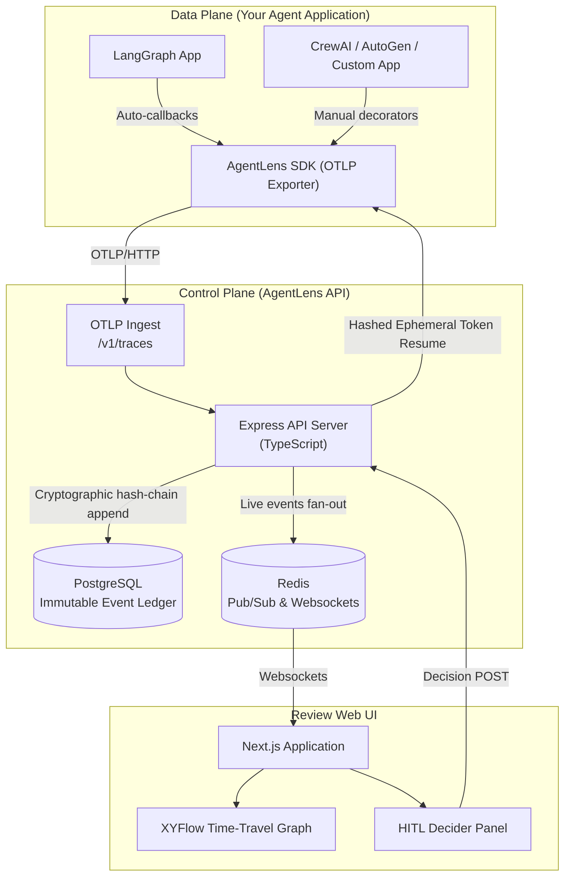

# AgentLens

<p align="center">
  <strong>Framework-agnostic Human-in-the-Loop telemetry and governance for multi-agent systems.</strong>
</p>

<p align="center">
  <a href="LICENSE"></a>
  <a href="CONTRIBUTING.md"></a>
  <a href="https://github.com/agentlens/agentlens/actions"></a>
  <a href="#"></a>
</p>

AgentLens ingests **OpenTelemetry traces** from any multi-agent framework, structures them into **visual execution graphs**, and provides a **review UI** with pause, review, and resume workflows — giving you observability and runtime control over multi-agent loops without coupling to any single framework.

---

## Features

- **Framework-Agnostic Ingestion** — Uses standard OTLP/HTTP (`/v1/traces`) and compatibility JSON endpoints. Features **first-class native integration for LangGraph** (via automated callback handler) and **standard manual telemetry instrumentation for other frameworks** (CrewAI, AutoGen, OpenAI Agents SDK, custom scripts) via core SDK decorators.
- **Visual Execution Graphs** — Every agent step, handoff, tool call, and delegating loop is projected into an interactive visual graph you can step through chronologically.
- **Human-in-the-Loop (HITL) Reviews** — Agents can raise interrupts when human review or authorization is required. Reviewers can approve, reject, or supply execution overrides directly from the web UI.
- **Timeline Branching** — Fork execution at any state step to explore alternative outcomes or overrides without affecting the original run.
- **Real-Time WebSocket Updates** — Watch agent runs progress live with Redis-backed pub/sub for horizontal scaling.
- **Automated Anomaly Detection** — Automated detection of execution anomalies, recursive loops, and agent failures with template-based summaries and LLM support.
- **Telemetry SDKs** — Clean, lightweight Python SDK decorators and context managers for custom frameworks, plus a zero-code LangGraph callback handler.
- **Database and File Storage** — Secure storage of run logs and states in PostgreSQL, with support for file-based artifact storage in MinIO.

## Tech Stack

| Layer | Technology |
|---|---|
| **API Server** | Node.js 20+, Express 5, TypeScript |
| **Web UI** | Next.js 16 (App Router), React 19, Tailwind CSS 4, [XYFlow](https://xyflow.com/) |
| **Database** | PostgreSQL 16 (missions, events, snapshots, agents) |
| **Cache & Pub/Sub** | Redis 7 (real-time WebSocket fan-out) |
| **Object Storage** | MinIO (S3-compatible, agent artifacts) |
| **Telemetry** | OpenTelemetry (custom OTLP/JSON exporter) |
| **Python SDKs** | Python 3.11+, OpenTelemetry SDK, httpx |
| **AI/LLM** | `@earendil-works/pi-coding-agent` (semantic summaries), BYOK model support |
| **Monorepo** | pnpm 9 + Turbo + uv (Python workspace) |
| **Validation** | Zod (TypeScript), Pydantic-style (Python, planned) |
| **Linting/Formatting** | ESLint 9, Prettier, Ruff (Python) |

## Quick Start

### Prerequisites

- **Node.js** 20+
- **pnpm** 9+
- **Python** 3.11+ (for SDKs and demos)
- **Docker** + Docker Compose (for PostgreSQL, Redis, MinIO)

### 1. Clone & Install

```bash
git clone https://github.com/agentlens/agentlens.git
cd agentlens

cp .env.example .env
pnpm install
```

### 2. Start Infrastructure

```bash
docker compose up -d
```

This boots PostgreSQL, Redis, and MinIO with health checks and auto-initialized buckets.

### 3. Start Dev Servers

```bash
pnpm dev
```

This launches both the API server (default port `8001`) and the Next.js web UI (default port `3000`) via Turborepo. Uses `scripts/ensure-docker.js` to confirm Docker is running before start.

To skip the Docker check:

```bash
pnpm dev:skip-docker
```

### 4. Configure the Web App

Create `apps/web/.env.local`:

```env
NEXT_PUBLIC_API_URL=http://localhost:8001
NEXT_PUBLIC_WS_URL=ws://localhost:8001
```

Open **http://localhost:3000**.

### 5. Run a Demo

```bash
uv sync
python examples/hitl_release_gate_demo.py
```

The demo runs a multi-agent execution with a LangGraph graph, raises a HITL interrupt, and prompts you to make a human decision. A markdown report is written to `examples/outputs/`.

For the incident response demo run:

```bash
python examples/hitl_incident_response_demo.py
```

For the software deployment audit demo run (LangGraph multi-agent):

```bash
python examples/demo_audit.py
```

## Monorepo Layout

```
agentlens/
├── apps/
│   ├── api-ts/           # TypeScript control plane (ingest, replay, HITL)
│   └── web/              # Next.js review UI + embedded AI assistant
├── packages/
│   ├── protocol/         # Shared TS schemas, semconv keys, API types (Zod)
│   ├── sdk-core/         # Python instrumentation SDK (AgentLens client)
│   ├── sdk-langgraph/    # LangGraph callback handler (auto-instrumentation)
│   ├── otel-semconv/     # Python semantic convention constants
│   └── graph-engine/     # Python graph layout & models
├── examples/             # HITL demo scenarios (release gate, incident response)
├── scripts/              # Dev helpers (Docker check, run-dev orchestrator)
├── docs/                 # Technical specifications
│   ├── semconv.md        # OTEL semantic convention reference
│   └── agent.md          # AI Agent architecture whitepaper
├── docker-compose.yml    # PostgreSQL, Redis, MinIO
├── turbo.json            # Turborepo pipeline config
├── pnpm-workspace.yaml   # pnpm workspace definition
└── pyproject.toml        # Python workspace (uv)
```

## Architecture & Data Flow

AgentLens is built on a high-throughput **control-plane / data-plane** split:



1. **Data Plane** — Your multi-agent application. The AgentLens Python SDK exports execution telemetry using standard OpenTelemetry spans and events.
2. **Control Plane** — The TypeScript API server. Ingests OTLP traces, projects the state graph history, handles secure hashed interrupts, and hosts the review API.
3. **Review UI** — A Next.js dashboard for browsing runs, inspecting execution graphs, submitting manual overrides, and forking execution paths.

For a deep-dive into the AI agent architecture, prompt engineering, tool definitions, and the replay state machine, see **[docs/agent.md](docs/agent.md)** and the architectural guide in **[docs/portfolio.md](docs/portfolio.md)**.

## Ingestion API

**Native OTLP/HTTP JSON:**

```text
POST http://localhost:8001/v1/traces
Content-Type: application/json
```

**Compatibility JSON:**

```text
POST http://localhost:8001/api/v1/ingest/otlp
Content-Type: application/json
```

Both endpoints accept spans with AgentLens semantic convention attributes (`agent.id`, `agent.role`, `agent.task`, etc.) and project them into run state graphs.

## Developer Workflows

### TypeScript

```bash
pnpm lint          # ESLint across all workspaces
pnpm test          # Vitest across all workspaces
pnpm format        # Prettier
pnpm build         # TypeScript compilation
```

### Python

```bash
uv sync            # Install Python dependencies
uv run pytest      # Run Python test suite
uv run ruff check  # Lint Python code
```

### Individual Packages

```bash
pnpm dev:api-ts             # API server only (hot reload)
pnpm --filter api-ts test   # API tests only
pnpm --filter web dev       # Web UI only
```

## Implemented vs Roadmap

### Currently Implemented (Core Telemetry & HITL)
- **OpenTelemetry Ingestion**: Standard OTLP/HTTP ingestion endpoint at `/v1/traces`.
- **Immutable Event Logs**: Sequential, historical execution logs stored in PostgreSQL.
- **Visual Execution Graphs**: Interactive temporal snapshots projected in the Next.js review UI.
- **HITL Review Protocol**: Secure, hashed resume token matching with local file-based decision bridging.
- **Docker Sandbox Runner**: Run branch forks in isolated docker containers with mounted configurations and disabled networks.
- **LangGraph Callback Adapter**: Automated out-of-the-box instrumentation.

### Roadmap (Future Plans)
- **Organization & Multi-Tenancy**: Workspace division and role-based access policies (RBAC).
- **Token Usage & Cost Metrics**: Real-time tracking of API usage, prompt token counts, and operational costs per run.
- **Advanced Run History Filters**: Robust search, tagging, and filtering capabilities for historical agent runs.
- **PII & Credential Masking**: Sanitization rules to scrub API keys, credentials, and PII from execution logs before database storage.
- **MicroVM Sandboxing Options**: Exploration of lightweight microVM platforms (like Firecracker) for stronger, faster sandbox isolation.

## License

Licensed under the Apache License, Version 2.0. See [LICENSE](LICENSE) for the full text.

---

<p align="center">
  <sub>Built for teams who need to observe, review, and steer their AI agents — not just trust them.</sub>
</p>
