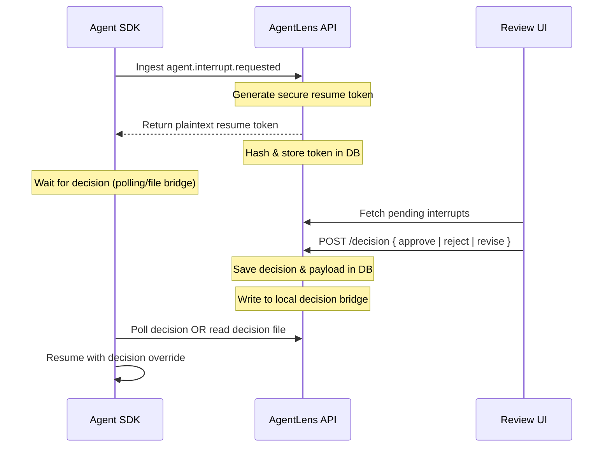

# Background

AgentLens exists because standard Application Performance Monitoring (APM) tools fail to capture the dynamic topology and state transitions of multi-agent systems. We designed the control plane to address these specific constraints and trade-offs.

## Why Standard APM Fails

Autonomous multi-agent systems (e.g., LangGraph, CrewAI, AutoGen) differ fundamentally from traditional microservices. A single high-level objective triggers complex cascades of internal tasks, tool invocations, peer reviews, consensus loops, and recursive handoffs. 

Standard APM tools (like Datadog, Jaeger, or Honeycomb) struggle here for several reasons:
1.  **State-Topology Blindness**: Standard APM traces depict execution waterfalls but fail to capture the evolving dynamic interaction topology of an agent network.
2.  **Immutability & Replayability Deficit**: Standard APM does not treat execution as a series of state-changing events. It cannot answer questions like: *"What did the graph topology look like exactly before Agent A escalated to Agent B?"* or *"Can we fork execution at step 3 to explore an alternative decision?"*
3.  **Human-in-the-Loop (HITL) Steerability**: Observability must not be read-only. In high-stakes AI applications, the control plane must support asynchronous pause, policy-driven gatekeeping, and resume-with-override capabilities.

We intentionally chose to establish a strict boundary between the data plane (where agents run) and the control plane (where states are ingested, replayed, evaluated, and versioned).

---

## 2. The Architectural Boundary: OpenTelemetry as a Framework-Agnostic Contract

Instead of forcing developers to adopt a proprietary runtime or coupling directly to specific SDK libraries, AgentLens implements a clean contract based on **OpenTelemetry (OTEL)**.

```
┌────────────────────────────────────────────────────────┐
│                      DATA PLANE                        │
│   LangGraph | CrewAI | AutoGen | Custom Agent Loops     │
└──────────────────────────┬─────────────────────────────┘
                           │
                           │ 1. Standard OTLP/HTTP JSON
                           │    via /v1/traces
                           ▼
┌────────────────────────────────────────────────────────┐
│                    CONTROL PLANE                       │
│    AgentLens Ingestion & Telemetry Normalization Boundary │
└──────────────────────────┬─────────────────────────────┘
                           │
                           │ 2. Schema Hydration
                           ▼
┌────────────────────────────────────────────────────────┐
│                    EVENT LEDGER                        │
│                 Canonical EventEnvelope                │
└────────────────────────────────────────────────────────┘
```

### Why OpenTelemetry?
*   **Standards-based**: Universal support allows instrumenting once without proprietary SDK lock-in.
*   **Schema-Driven Ingestion**: The data plane transmits telemetry using standard HTTP/JSON traces at `/v1/traces`.
*   **Decoupled Instrumentation**: Frameworks like LangGraph use a non-invasive callback handler (`sdk-langgraph`) that runs out-of-band and does not alter agent execution.

### Telemetry Normalization & Projected EventEnvelope
At the ingestion boundary, OTLP spans and attribute maps are persisted as span evidence. The server derives compatible **`EventEnvelope`** values for replay and presentation from that evidence:
1.  **Actor Attribution**: Classifies *WHO* generated the event (`actor_type: 'agent' | 'tool' | 'human' | 'policy' | 'system'`).
2.  **Causal Context**: Captures *WHY* the event occurred by establishing chronological and parent-child span lineages (`parent_span_id`, `tool_call_id`, `decision_for_event_id`).
3.  **Model Provenance**: Attributes decisions to exact LLM parameters (tokens used, temperature, stop reason, version).
4.  **Error Attribution**: Forensic classification of exceptions (`hallucination`, `prompt_injection`, `tool_failure`).
5.  **Policy Decision**: Records rules evaluated by the policy engine (`deny`, `require_review`, `allow`).

---

## 3. Span-Driven Replay & Dynamic Graph Projections

The current AgentLens control plane persists OTLP spans (including span events), interrupts, and branch/control records. Replay, graph snapshots, current runtime state, summaries, and `EventEnvelope`-shaped timeline values are deterministic server-side projections; they are not a persisted event ledger.

### The Replay Algorithm (`replayMissionEvents`)
To project the execution graph at any sequence number:
1.  Query the chronological event timeline of the mission.
2.  Initialize an empty graph topology (empty nodes map, empty edges map).
3.  Process each event sequentially:
    *   `agent.registered` → Creates an agent node.
    *   `span.started` → Transitions agent/task status.
    *   `tool.called` → Spawns a tool node and connects it with a `uses` edge.
    *   `delegation` / `handoff.requested` → Creates a `delegation` edge between agents.
4.  Derive a structural snapshot on demand for time-travel navigation.

### Integrity Reporting
The current span-backed persistence does not persist or verify a hash chain. Until that support exists, `verifyMissionIntegrity` reports `unsupported` / not verified and the UI makes no claim that evidence is cryptographically secure or compromised.

---

## 4. Human-in-the-Loop (HITL) Governance Protocol

When an agent needs human review, or a policy rule flags an execution, the system pauses execution using an asynchronous resume token workflow.



### Secure Token Design
The plaintext resume token is generated via a cryptographically secure random generator, returned *once* to the data plane agent, and stored in the database strictly as a **SHA-256 hash**. This ensures that even if the control plane database is compromised, an attacker cannot forge resume commands to intercept running agent processes.

---

## 5. Timeline Branching & Sandbox Execution Trade-Offs

**Timeline branching** allows forking execution from any branchable sequence number (such as a tool call, a handoff, or a human interrupt) to simulate alternative paths.

```
Main branch:     E0 ── E1 ── E2 ── E3 (Interrupt) ── E4 ── E5
                              │
Fork at E2:                   └───► B1 (What-If Branch) ── B2 
```

### Docker-Based Sandbox Isolation (The Trade-Offs)
We run sandboxed workers to isolate timeline branch execution from the live system. This balance keeps resource usage manageable:

*   **Current Docker Isolation**: We spawn a stateless Docker container using the registered `branch_executor_specs`. 
*   **Networking**: The container runs under `--network none` to prevent side-effects, resource leaks, or outbound network tampering during simulated "what-if" branches.
*   **State Injection**: The sandbox context (injections, overrides) is mounted read-only as `context.json` into `/agentlens/context`.
*   **Local Decision Bridge**: The parent decisions are communicated into the sandbox via a file-based JSONL bridge (`decisions.jsonl`), allowing the sandboxed agent to "read" human responses without requiring live API network requests.
*   **Limitations**: High-fidelity branching requires mocking database connections, API calls, and model outputs. We currently simulate these external factors using local mock configurations.

---

## 6. Implementation Status & Roadmap

For detailed information on current implementation status and the strategic hardening roadmap, please see [Roadmap](../project/roadmap.md).
