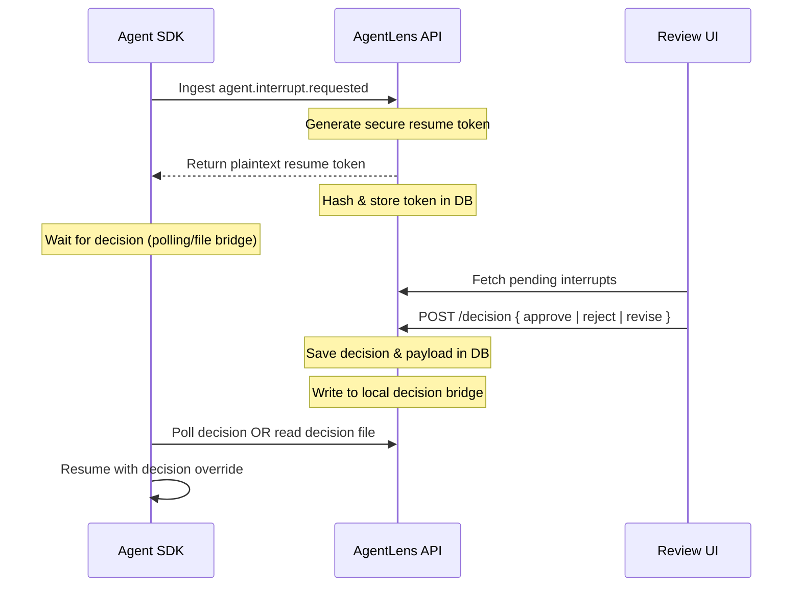

# AgentLens: Framework-Agnostic Observability & Governance Control Plane for Autonomous Multi-Agent Systems

Welcome to the technical deep-dive of **AgentLens**. This document is designed for AI Infrastructure, Platform, and Distributed Systems engineers evaluating the architectural decisions, trade-offs, and design choices behind this portfolio-grade observability and governance control plane.

---

## 1. Problem Statement: Why Standard APM Fails Multi-Agent Systems

Autonomous multi-agent systems (e.g., built on LangGraph, CrewAI, AutoGen) are fundamentally different from traditional microservices. A single high-level objective triggers complex cascades of internal tasks, tool invocations, peer reviews, consensus loops, and recursive handoffs. 

Standard Application Performance Monitoring (APM) tools (like Datadog, Jaeger, or Honeycomb) fail here for several key reasons:
1.  **State-Topology Blindness**: Standard APM traces depict execution waterfalls but fail to capture the evolving **dynamic interaction topology** of an agent network.
2.  **Immutability & Replayability Deficit**: Standard APM does not treat execution as a series of state-changing events. It cannot answer questions like: *"What did the graph topology look like exactly before Agent A escalated to Agent B?"* or *"Can we fork execution at step 3 to explore an alternative decision?"*
3.  **Human-in-the-Loop (HITL) Steerability**: Observability must not be read-only. In high-stakes AI applications (financial, security, infrastructure), the control plane must support asynchronous pause, policy-driven gatekeeping, and resume-with-override capabilities.

**AgentLens** solves this by establishing a strict boundary between the **data plane** (where agents run) and the **control plane** (where states are ingested, replayed, evaluated, and versioned).

---

## 2. The Architectural Boundary: OpenTelemetry as a Framework-Agnostic Contract

Instead of forcing developers to adopt a proprietary runtime or coupling directly to specific SDK libraries, AgentLens implements a clean contract based on **OpenTelemetry (OTEL)**.

```
┌────────────────────────────────────────────────────────┐
│                      DATA PLANE                        │
│   LangGraph | CrewAI | AutoGen | Custom Agent Loops     │
└──────────────────────────┬─────────────────────────────┘
                           │
                           │ 1. Standard OTLP/HTTP JSON
                           │    via /v1/traces
                           ▼
┌────────────────────────────────────────────────────────┐
│                    CONTROL PLANE                       │
│    AgentLens Ingestion & Telemetry Normalization Boundary │
└──────────────────────────┬─────────────────────────────┘
                           │
                           │ 2. Schema Hydration
                           ▼
┌────────────────────────────────────────────────────────┐
│                    EVENT LEDGER                        │
│                 Canonical EventEnvelope                │
└────────────────────────────────────────────────────────┘
```

### Why OpenTelemetry?
*   **Industry Standard**: Universal vendor support means zero vendor lock-in.
*   **Schema-Driven Ingestion**: The data plane transmits telemetry using standard HTTP/JSON traces at `/v1/traces`.
*   **Decoupled Instrumentation**: Frameworks like LangGraph use a non-invasive callback handler (`sdk-langgraph`) that runs out-of-band and does not alter agent execution.

### Telemetry Normalization & EventEnvelope
At the ingestion boundary (`SpanNormalizer.ts`), OTLP spans and attribute maps are parsed into a rich, structured **`EventEnvelope`** schema:
1.  **Actor Attribution**: Classifies *WHO* generated the event (`actor_type: 'agent' | 'tool' | 'human' | 'policy' | 'system'`).
2.  **Causal Context**: Captures *WHY* the event occurred by establishing chronological and parent-child span lineages (`parent_span_id`, `tool_call_id`, `decision_for_event_id`).
3.  **Model Provenance**: Attributes decisions to exact LLM parameters (tokens used, temperature, stop reason, version).
4.  **Error Attribution**: Forensic classification of exceptions (`hallucination`, `prompt_injection`, `tool_failure`).
5.  **Policy Decision**: Records rules evaluated by the policy engine (`deny`, `require_review`, `allow`).

---

## 3. Event-Sourced Replay & Dynamic Graph Projections

The AgentLens control plane is built on an **Event-Sourced** architecture. The database does not maintain a mutable "latest state" of the graph. Instead, the canonical source of truth is the **immutable event ledger** (`mission_events` table).

### The Replay Algorithm (`replayMissionEvents`)
To project the execution graph at any sequence number:
1.  Query the chronological event timeline of the mission.
2.  Initialize an empty graph topology (empty nodes map, empty edges map).
3.  Process each event sequentially:
    *   `agent.registered` → Creates an agent node.
    *   `span.started` → Transitions agent/task status.
    *   `tool.called` → Spawns a tool node and connects it with a `uses` edge.
    *   `delegation` / `handoff.requested` → Creates a `delegation` edge between agents.
4.  Optionally persist structural snapshots (`graph_snapshots` table) to support instantaneous time-travel navigation.

### Cryptographic Ledgers for Tamper Evidence
To guarantee the historical audit trail is tamper-proof, every event appended to a branch is cryptographically bound using a SHA-256 hash chain:
$$\text{content\_hash} = \text{SHA256}(\text{mission\_id} + \text{branch\_id} + \text{sequence\_num} + \text{event\_type} + \text{payload} + \text{previous\_hash})$$

If a payload is tampered with, or if an event is deleted/inserted out of order, the `verifyMissionIntegrity` API detects the lineage break immediately, flagging the mission as `COMPROMISED` in the UI.

---

## 4. Human-in-the-Loop (HITL) Governance Protocol

When an agent needs human review, or a policy rule flags an execution, the system pauses execution using an asynchronous resume token workflow.



### Secure Token Design
The plaintext resume token is generated via a cryptographically secure random generator, returned *once* to the data plane agent, and stored in the database strictly as a **SHA-256 hash**. This ensures that even if the control plane database is compromised, an attacker cannot forge resume commands to intercept running agent processes.

---

## 5. Timeline Branching & Sandbox Execution Trade-Offs

One of the most powerful capabilities of AgentLens is **Timeline Branching**. A reviewer can fork execution from any branchable sequence number (e.g., a tool call, a handoff, or a human interrupt) to simulate alternative paths.

```
Main branch:     E0 ── E1 ── E2 ── E3 (Interrupt) ── E4 ── E5
                              │
Fork at E2:                   └───► B1 (What-If Branch) ── B2 
```

### Docker-Based Sandbox Isolation (The Trade-Offs)
To execute a timeline branch deterministically without interfering with the live system, AgentLens launches a sandboxed worker. This architecture balances isolation against resource constraints:

*   **MVP Isolation (Implemented)**: The control plane spawns a stateless Docker container using the registered `branch_executor_specs`. 
*   **Networking**: The container runs under `--network none` to prevent side-effects, resource leaks, or outbound network tampering during simulated "what-if" branches.
*   **State Injection**: The sandbox context (injections, overrides) is mounted read-only as `context.json` into `/agentlens/context`.
*   **Local Decision Bridge**: The parent decisions are communicated into the sandbox via a file-based JSONL bridge (`decisions.jsonl`), allowing the sandboxed agent to "read" human responses without requiring live API network requests.
*   **Limitations**: High-fidelity branching requires mocking database connections, API calls, and model outputs. In the v0.1 MVP, these external factors are simulated via local mock configurations.

---

## 6. Implementation Status Matrix

| Subsystem | Implemented Capabilities | Hiring Portfolio Target |
|---|---|---|
| **Ingestion** | OTLP/HTTP `/v1/traces` & `/api/v1/ingest/otlp` JSON normalization | Framework-agnostic contract boundary |
| **Replay Graph** | Chronological replay, dynamic state projection, time-series snapshots | Complex time-series state machines |
| **Governance** | Built-in policy engine, strictness precedence matching (`deny` > `require_review`) | Automated runtime guardrails |
| **Audit Trails** | SHA-256 event chaining, payload validation, missing-event detection | Cryptographic distributed ledger design |
| **HITL Loops** | Ephemeral hashed resume tokens, async polling protocol, decision payloads | Highly secure, asynchronous workflows |
| **Branching** | Lineage tree building, Docker execution runner, log streaming, telemetry feedback | Sandbox orchestration & containers |

---

## 7. Strategic Hardening Roadmap

To transition this portfolio project into a production-grade enterprise control plane:
1.  **Distributed Consensus**: Replace local database state locking with a distributed raft-based consensus layer to handle high-throughput telemetry ingestion.
2.  **VM Sandboxing**: Migrate container sandboxes to microVM systems (e.g., Firecracker) to achieve faster cold-start times (sub-100ms) and secure kernel-level isolation.
3.  **Encrypted Event Streams**: Support zero-knowledge event storage where agent payloads remain encrypted using client-side keys, and the control plane only evaluates policy metadata.
