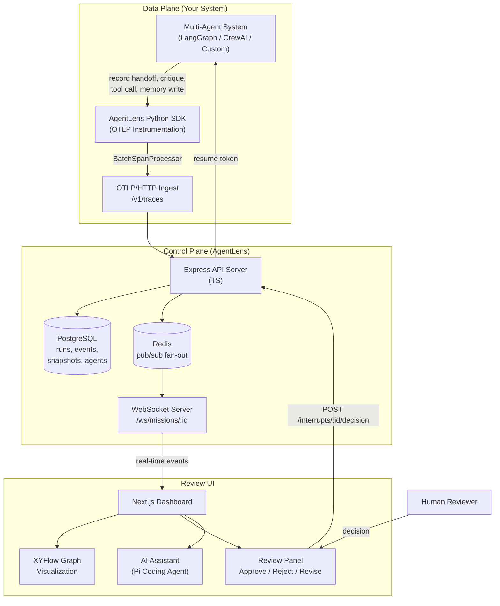
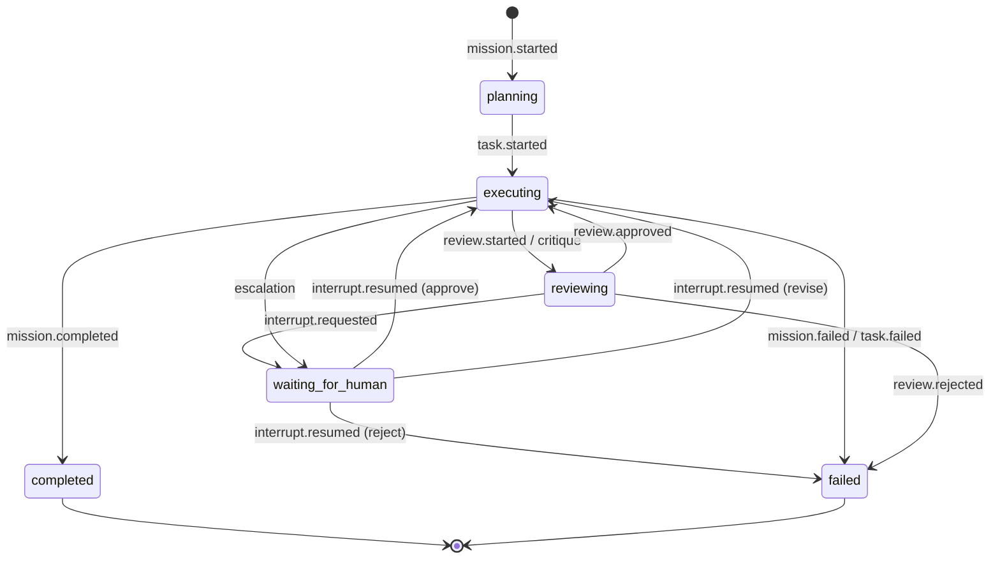
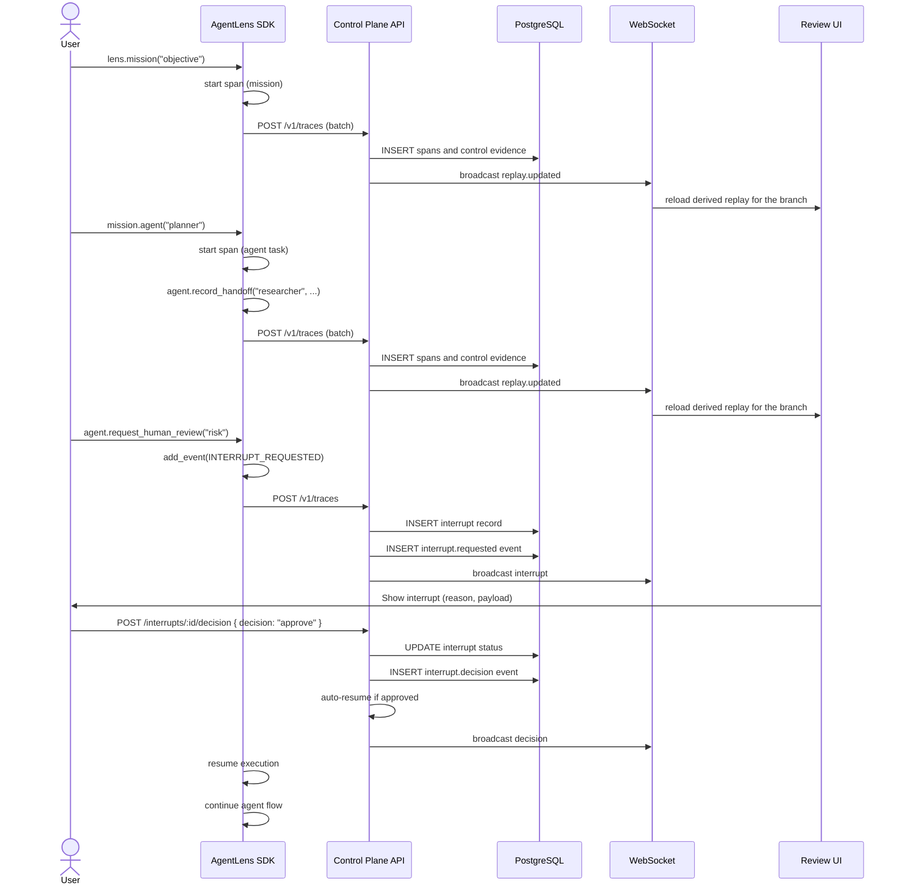

# AgentLens System Architecture & Telemetry Design

**Version**: 0.1.0 | **Last Updated**: 2026-05-25

---

## Table of Contents

1. [Architectural Overview](#architectural-overview)
2. [Agent Lifecycle & State Machine](#agent-lifecycle--state-machine)
3. [Tools & Capabilities](#tools--capabilities)
4. [Prompt Engineering & Memory](#prompt-engineering--memory)
5. [LLM Gateway & Credential Management](#llm-gateway--credential-management)
6. [Replay Engine & Branch Semantics](#replay-engine--branch-semantics)
7. [Semantic Conventions (OTEL)](#semantic-conventions-otel)

---

## Architectural Overview

AgentLens decouples telemetry collection from agent execution using a data-plane / control-plane split:

- **Data Plane**: Your multi-agent application (built on LangGraph, CrewAI, AutoGen, OpenAI Agents, or custom loops) runs normally. The AgentLens Python SDK exports execution telemetry using standard OpenTelemetry spans and events.
- **Control Plane**: The TypeScript API server. Ingests OTLP traces at a standard OTLP/HTTP ingestion endpoint, projects the states into visual execution graphs, manages runtime review interrupts, and serves a Next.js web interface.

### High-Level System Architecture



### Framework Support Matrix

| Framework | Integration | Status |
|---|---|---|
| **LangGraph** | First-class callback handler (`agentlens_langgraph`) | Stable |
| **CrewAI** | Telemetry via core `agentlens_sdk` | Supported |
| **AutoGen** | Telemetry via core `agentlens_sdk` | Supported |
| **OpenAI Agents SDK** | Telemetry via core `agentlens_sdk` | Supported |
| **Microsoft Agent Framework** | Telemetry via core `agentlens_sdk` | Supported |
| **Custom / In-House** | `AgentLens` client + `Mission.agent()` context managers | Full API |

---

## Agent Lifecycle & State Machine

### The Run as a Unit of Work

A **Run** (historically named Mission in telemetry constants) is the top-level unit of execution. It tracks one complete multi-agent workflow — from planning through execution, review, and completion or failure.



### Event-Driven Graph Construction

Every agent action is recorded as an **event** with a monotonically increasing `sequence_num` in an append-only event log. The system processes events from `sequence_num = 0` to reconstruct the execution graph. This design enables:

- **Deterministic reconstruction**: Replaying the same event stream produces identical state graphs.
- **Timeline branching**: Create a new execution branch from any `sequence_num` to test alternative inputs or overrides.
- **Time-travel debugging**: Jump to any past step in the timeline to inspect the active state at that moment.

### Agent Lifecycle (Per-Agent)



### Node Types in the Graph

Each event transitions a set of **nodes** and **edges** in the runtime graph:

| Node Type | Represents | Created By |
|---|---|---|
| `agent` | A single agent runtime instance | `agent.registered` event |
| `task` | A work item assigned to an agent | `task.started` event (from span with `agent.span.kind = agent.task`) |
| `tool` | An external tool or API called by an agent | `tool.called` event (from span with `agent.span.kind = agent.tool.call`) |
| `human` | A human reviewer or supervisor | `escalation` event |
| `memory` | A named shared database or state store | `memory.written` event |
| `team` | A logical grouping of agents | (planned) |
| `artifact` | An output document, file, or dataset | `artifact.created` event |

### Edge Types

| Edge Type | Meaning | Status Progression |
|---|---|---|
| `dependency` | Agent → Task (executes) | active → completed / failed |
| `uses` | Agent → Tool (calls) | active → completed / failed |
| `delegation` | Agent → Agent (delegates / handoff) | pending → active → completed / failed |
| `critique` | Agent → Agent (peer review) | active |
| `review` | Agent → Agent (formal review) | active → completed / failed |
| `escalation` | Agent → Human (escalates) | active |
| `data_flow` | Agent → Memory (writes) | active |
| `produces` | Agent → Artifact (produces) | active → completed |
| `approval` | Human → Agent (approves) | (planned) |
| `member_of` | Agent → Team | (planned) |

---

## Tools & Capabilities

### SDK Instrumentation Tools

The Python SDK provides the following instrumentation methods on `AgentInstrumentor`:

| Method | OTEL Event | Graph Effect |
|---|---|---|
| `set_task(task)` | Sets `agent.task` span attribute | Creates/updates task node |
| `set_goal(goal)` | Sets `agent.goal` span attribute | Updates agent node summary |
| `set_confidence(float)` | Sets `agent.confidence` span attribute | Updates agent node confidence |
| `record_handoff(target, task, reason)` | `agent.handoff.requested` | Creates delegation edge |
| `record_delegation(target, task, reason)` | (alias for record_handoff) | Legacy compatibility |
| `record_critique(target, result, details)` | `agent.critique` | Creates critique edge |
| `record_review(result, details)` | `agent.review.*` | Creates review edge |
| `record_tool_call(name, input, output, status)` | `agent.tool.call` | Creates/updates tool node + uses edge |
| `record_memory_write(key, value)` | `agent.memory.write` | Creates memory node + data_flow edge |
| `record_memory_read(key, value)` | `agent.memory.read` | Tracks read access (no graph effect) |
| `record_escalation(target, reason)` | `agent.escalation` | Creates human node + escalation edge |
| `record_reflection(insight)` | `agent.reflection` | Self-reflection log (no graph node) |
| `record_artifact(name, type)` | `agent.artifact.created` | Creates artifact node + produces edge |
| `request_human_review(reason, ...)` | `agent.interrupt.requested` | Creates interrupt record, sets phase |
| `record_human_decision(decision, ...)` | `agent.human.decision` | Records decision on interrupt |

### Control Plane Capabilities

The API exposes these capabilities for external orchestration:

| Capability | Endpoint | Description |
|---|---|---|
| Run Logs CRUD | `GET/POST/PATCH/DELETE /api/v1/missions` | Full run lifecycle management |
| Graph Retrieval | `GET /api/v1/missions/:id/graph` | Current state graph (nodes + edges) |
| Snapshot History | `GET /api/v1/missions/:id/graph/snapshots` | Paginated chronological snapshots |
| Replay Engine | `GET /api/v1/missions/:id/replay` | Complete run history, snapshots, and states |
| Branch Management | `GET/POST /api/v1/missions/:id/replay/branches` | List and create execution branch forks |
| Event Stream | `GET /api/v1/missions/:id/events` | Raw execution event logs |
| Interrupt Management | `GET/POST /api/v1/missions/:id/interrupts` | List and submit decisions for HITL interrupts |
| Semantic Summaries | `GET/POST /api/v1/missions/:id/summary` | Automated run state explanations |
| Why-This-State | `POST /api/v1/missions/:id/why-this-state` | Contextual state analysis |
| Artifact Storage | `GET/POST /api/v1/missions/:id/artifacts` | Run artifacts stored via MinIO |
| Key Sharing | `POST /api/v1/missions/:id/share` | Run sharing settings |
| Real-Time Streaming | `WS /ws/missions/:id` | WebSockets for live graph updates |

### LangGraph Callback Handler

The `AgentLensLangGraphCallbackHandler` provides zero-code instrumentation for LangGraph applications:

- **`on_chain_start`**: Each LangGraph node is automatically instrumented as an agent. Node-to-node transitions create handoff events.
- **`on_chain_end`**: Node outputs are recorded as memory writes. Completion events mark the handoff as accepted.
- **`on_chain_error`**: Errors mark the handoff as rejected and the agent span as failed.
- **`on_tool_start / on_tool_end / on_tool_error`**: Tool invocations within nodes are captured as `agent.tool.call` events.

Framework-internal nodes (`LangGraph`, `RunnableSequence`, `RunnableParallel`, `StateGraph`) are automatically filtered out.

---

## Prompt Engineering & Memory

### Semantic Engine Architecture

AgentLens uses a **dual-path semantic engine** for generating human-readable explanations of execution state:

```
                    ┌─────────────────────────┐
                    │   Request for Summary    │
                    └───────────┬─────────────┘
                                │
                    ┌───────────▼─────────────┐
                    │   Try LLM Path (Primary) │
                    │   @earendil-works/pi-    │
                    │   coding-agent           │
                    └───────────┬─────────────┘
                                │
                        ┌───────▼───────┐
                        │  Success?      │
                        │  (valid JSON,  │
                        │   15s timeout)  │
                        └───┬───────┬───┘
                            │ YES   │ NO
                    ┌───────▼──┐ ┌──▼──────────┐
                    │ Return   │ │ Deterministic │
                    │ LLM      │ │ Template-Based│
                    │ Summary  │ │ Fallback      │
                    └──────────┘ └──────────────┘
```

### System Prompt Design

We design prompts to structure context and output for the semantic analysis model:

1. **System-level framing**: We instruct the model to act as a system analyst describing execution topology and flow rather than a narrative log translator. This produces structural analysis instead of plain storytelling.
2. **Context injection**: We build each prompt from the run aggregate (objective, active agents, snapshots, event timeline) and organize it into sections:
   - Run objective and status
   - Agent states with roles, statuses, and last-known reasons
   - Graph topology (node types, labels, statuses)
   - Edge relationships (source → target, type, label)
   - Recent event timeline (last 8 events)
3. **Structured output**: Both summary paths enforce JSON output with the exact schema `{ summary, conflicts, anomalies }`. The parse pipeline handles markdown code fences and bare JSON objects.
4. **Timeout and degradation**: LLM calls are bounded by a configurable timeout (`SUMMARY_TIMEOUT_MS`, default 15 seconds). On timeout or parse failure, the system falls back to deterministic templates that compute the same JSON structure from graph topology alone.

### Fallback Templates

The deterministic fallback for `generateMissionSummary` computes:
- **System state** classification: actively progressing, paused at review gate, completed, or failed
- **Conflict detection**: excessive delegation loops (`delegation_count > agents.length * 3`)
- **Anomaly detection**: human escalations, rejected critiques
- **Activity summary**: active agents and active execution phases

The `generateWhyThisState` fallback analyzes:
- Phase semantics (human review gate, review cycle, planning, execution)
- Agent dynamics (active, blocked, waiting, failed, completed)
- Dependency blocking (which agents are blocked by unresolved tasks)
- Structural patterns (review bottlenecks, handoff chains, escalation paths)

### Memory Model

AgentLens does **not** maintain a vector database or RAG pipeline. Instead, memory is modeled as:

1. **Short-Term / Episodic Memory**: The event log (`mission_events` table). Every agent action is an immutable, sequenced event. The replay engine reads this to reconstruct state.
2. **Semantic Memory**: Automated summaries stored in the `semantic_summaries` table with levels (`mission`, `why_this_state`).
3. **Agent Memory Events**: The `agent.memory.write` and `agent.memory.read` events create `memory`-type nodes in the graph, representing shared knowledge stores that agents interact with. This is a **graph-level abstraction** — the actual memory implementation (in-memory dict, Redis, database) is left to the instrumented application.

---

## LLM Gateway & Credential Management

### Embedded AI Assistant

The web UI includes an AI assistant ("Ask Pi") powered by `@earendil-works/pi-coding-agent` (v0.74). This is embedded directly in the API server and invoked server-side:

- **Endpoint**: `POST /api/assistant` → handled by the Next.js API route
- **Context**: The assistant receives the current `missionId`, `missionObjective`, and `missionStatus` with each prompt
- **Session**: Uses `createAgentSession` with `SessionManager.inMemory()` — sessions are ephemeral and per-request

### Semantic Analysis LLM

The `generateMissionSummary` and `generateWhyThisState` functions also use `@earendil-works/pi-coding-agent`:

- **Mode**: Tool-free (`noTools: 'all'`) — the agent only generates text, cannot execute code
- **Session Lifecycle**: Created per-request, disposed after response (or timeout)
- **Output Parsing**: Multi-stage fallback: direct JSON parse → markdown code fence extraction → bare brace extraction → deterministic fallback

### BYOK (Bring Your Own Key) Model

For external LLM providers used by the instrumented application itself (not the AgentLens control plane), the setup is:

- **Environment Variables**: The `.env.example` documents optional variables for `OPENAI_API_KEY`, `ANTHROPIC_API_KEY`, `LLM_PROVIDER` (openai | anthropic | ollama), `LLM_MODEL`, and `OLLAMA_URL`.
- **Provider Aliases**: The demo scenarios support provider-specific aliases (`ROUND_TABLE_BASE_URL`, `ROUND_TABLE_API_KEY`, `ROUND_TABLE_MODEL`, plus team-specific aliases `RELA_AI_*` and `RELE_AI_*`).
- **No Hard Dependency**: The control plane does not require an LLM to function. The semantic engine gracefully degrades to template-based analysis when no LLM is configured or when the LLM is unreachable.

### Credential Security Model

- **API Key Storage**: Credentials are read from environment variables only (`process.env` / `dotenv`). No credentials are stored in the database, code, or configuration files.
- **`.env` Isolation**: The `.gitignore` blocks all `.env` files except `.env.example`.
- **Bearer Token Auth**: When configured, the SDK sends `Authorization: Bearer <api_key>` headers with ingest requests.
- **Resume Token Hashing**: Interrupt resume tokens are SHA-256 hashed before storage in the `interrupts` table. The plaintext token is returned once to the requesting agent and never stored.
- **Idempotency**: Decision endpoints (`POST /interrupts/:id/decision`) require an `idempotency_key` to prevent duplicate processing. The key is checked against the database under advisory locks.

---

## Replay Engine & Branch Semantics

### Event Replay Algorithm

The replay engine (`replayMissionEvents`) processes events sequentially by `sequence_num`:

1. Initialize an empty `InternalRuntimeState` with `nodeMap` and `edgeMap`.
2. For each event in order, call `applyMissionEvent(state, event)`:
   - Update agent state (status, current task, confidence, summary)
   - Create or update graph nodes (agent, task, tool, human, memory, artifact)
   - Create or update graph edges (dependency, delegation, critique, review, etc.)
   - Update interrupt state (pending → approved/rejected/resumed)
3. After each event, capture a `GraphSnapshot` containing the full node and edge arrays at that point.
4. Return the list of snapshots and the final `RuntimeState`.

### Branch Forking

Branches are implemented as a view over the event log:

- **`buildBranchLineage`**: Walks the `parent_branch_id` chain to build a lineage from root to the requested branch.
- **`selectEventsForBranch`**: Filters events to include only those from branches in the lineage, stopping each branch at its `forked_from_sequence_num` (if a child branch forks from it).
- **New events** on a branch are appended with their own `sequence_num` and `branch_sequence_num`, isolated from the parent branch.

```
Main branch:        E0 → E1 → E2 → E3 → E4 → E5
                                          │
Fork at seq=3:                             └──→ B1 → B2 (on "what-if" branch)
```

### Runtime State Snapshot

Each snapshot contains the complete graph topology at that event, enabling:
- Time-series visualization in the UI
- Diff-based analysis between snapshots
- Agent drift detection (comparing expected vs. actual agent state progression)

---

## Semantic Conventions (OTEL)

AgentLens defines a comprehensive set of OpenTelemetry semantic convention attributes and events. The canonical reference is in [semconv.md](semconv.md).

---

## Future Roadmap

- **Team nodes**: Hierarchical grouping of agents with aggregate metrics
- **Agent drift scoring**: Statistical comparison of actual vs. expected agent behavior
- **Policy engine**: Declarative rules for automatic review gating (e.g., "require human review when confidence < 0.7")
- **Multi-tenant isolation**: Per-organization namespaces with role-based access control
- **Vector memory backends**: Optional integration with vector databases for long-term agent memory
