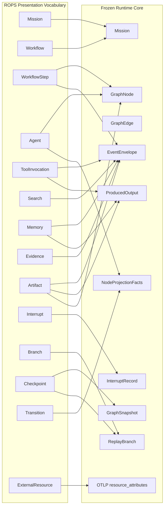
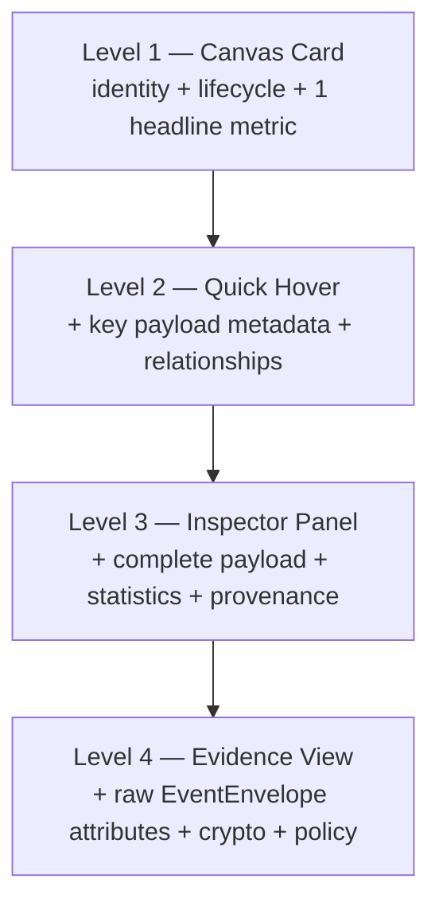

# Runtime Object Presentation Specification (ROPS)

Status: **Specification (long-term UI contract)**
Applies to: AgentLens runtime presentation surfaces
Runtime core status: **Frozen** (do not redesign)

This document is a specification, not an implementation. It defines **how every Runtime Object should be presented**. It does not describe React components, CSS, or any specific rendering library. It does not redefine the runtime, the event ledger, the graph, the replay engine, or the projection core.

All field names cited in this specification are the **real field names** from the frozen AgentLens runtime core. Anchors are given as `file:line` references into the repository.

---

## 1. Purpose & Scope

### 1.1 Problem

AgentLens successfully reconstructs runtime topology: execution order, lineage, topology, and orchestration. Users still cannot answer, for a given runtime object:

- What is this runtime object?
- What operation is executing?
- What input produced this node?
- What output did this node generate?
- What runtime state does this node hold?

The graph shows **topology**. It does not yet expose **runtime context** in a uniform, evidence-grounded way.

### 1.2 Goal

ROPS defines a single, implementation-independent contract for presenting the runtime context of every Runtime Object across a small number of disclosure levels. It is the long-term UI contract for AgentLens: any compliant presentation surface (current or future, web or otherwise) must satisfy ROPS.

### 1.3 Non-goals (explicit)

- ROPS does **not** redesign Runtime Event, Runtime Graph, Runtime Node, Runtime Edge, Replay Engine, or Runtime Projection.
- ROPS does **not** introduce new runtime entities. The ROPS object types defined in section 3 are a **presentation vocabulary** mapped onto existing frozen types; they are not new protocol types and must never be added to `packages/protocol/src/types.ts`.
- ROPS does **not** prescribe React, component libraries, layout, color values, or pixel sizes.
- ROPS does **not** interpret runtime. It exposes runtime.

### 1.4 Frozen-core anchors used throughout

- `packages/protocol/src/types.ts` — `NodeType`, `NodeStatus`, `EdgeType`, `EdgeStatus`, `GraphNode`, `GraphEdge`, `GraphSnapshot`, `Mission`, `MissionAgent`, `ReplayBranch`, `InterruptRecord`, `RuntimeAgentState`, `RuntimeInterruptState`, `NodeProjectionFacts`, `NodeProjectionGenerated`, `RuntimeNodeProjection`, `RuntimeEventType`, `MissionEventRecord`, `EventEnvelope`, `CausalContext`, `ModelProvenance`, `ErrorAttribution`, `PolicyDecision`, `ActorType`, `ErrorSource`, `ErrorCause`, `OutputType`, `ProducedOutput`, `RuntimeEventRef`, `RuntimeFactWarning`.
- `packages/protocol/src/projections/projectionScratch.ts` — `applyEventToScratch`, `buildEventRef`, `statusLabel`, `NOISE_EVENT_TYPES`, `AgentNodeScratch`, `MissionProjectionScratch`.
- `packages/protocol/src/projections/nodeStateProjection.ts` — `projectNodeState`, `projectAllNodeStates`, `scratchToFacts`, `buildNodeProjection`.
- `packages/protocol/src/projections/runtimeProjection.ts` — `RUNTIME_PROJECTION_VERSION`, `NODE_PROJECTION_VERSION`, `NODE_GENERATED_PROJECTION_VERSION`, `DETERMINISTIC_PROMPT_VERSION`.
- `packages/protocol/src/semconv.ts` — `AgentAttributes`, `MissionAttributes`, `AgentEvents`, `AgentSpanKind`, `LLMAttributes`, `ErrorAttributes`.
- `packages/protocol/src/schemas.ts` — `MissionStatusSchema`, `MissionPhaseSchema`, `InterruptStatusSchema`, `HumanDecisionSchema`, `BranchPointKindSchema`, `BranchCapabilitySchema`, `BranchSandboxJobSchema`, `OtlpIngestRequestSchema`.
- `apps/api-ts/src/services/runtime/projection.ts` — `classifySpan` (maturity tiers), `projectTraceSnapshot` (L1/L2/L3 edge projection incl. `basestation.aiops.*` namespace).

---

## 2. Runtime Object Presentation Principles

### P1 — Evidence-or-projection rule (the core principle)

Every visible field in any presentation must satisfy exactly one of:

1. **Runtime Evidence** — the value is present in a runtime record as emitted by the runtime (an `EventEnvelope` field, an `EventEnvelope.payload` key, an `EventEnvelope.model`/`causal`/`policy`/`error` sub-field, a `GraphNode`/`GraphEdge`/`GraphSnapshot` field, an `InterruptRecord` field, a `ReplayBranch` field, or an OTLP `resource_attributes`/`span.attributes` key).
2. **Runtime Projection** — the value is the output of a deterministic, reproducible, idempotent function over Runtime Evidence only (e.g. `scratchToFacts`, `statusLabel`, `duration_ms = end_time − start_time`, edge derivation in `projectTraceSnapshot`).

It is **never** permitted to present a field that is:

- reasoning
- intentions
- goals (as narrative — `gen_ai.agent.goal` as a raw attribute is Evidence and may be shown verbatim)
- summaries (synthesized)
- explanations
- inferred semantics

The UI exposes runtime. It never interprets runtime.

### P2 — Projections are disposable; the ledger is authoritative

`MissionEventRecord` / `EventEnvelope` is the canonical ledger. `GraphNode`, `GraphEdge`, `GraphSnapshot`, `RuntimeState`, `RuntimeAgentState`, `RuntimeNodeProjection`, and `RuntimeSummary` are disposable projections rebuildable from events (the `RuntimeProjection` base interface and the `source: 'deterministic' | 'llm'` flag make this explicit). ROPS treats projections as a presentation source but never as ground truth. When a projection and the underlying event disagree, the event wins (see section 6, Evidence View).

### P3 — Provenance is labeled

Every projected field shown in a presentation must carry a visible provenance label (`[projection]`) at Level 3 and below when the value is not present verbatim in runtime evidence. Evidence fields need no label. This lets an operator distinguish "the runtime said this" from "the system computed this from the runtime".

### P4 — Inference quarantine

A small number of existing surfaces emit synthesized/LLM content. These are **out of contract** under ROPS and must not be presented on any runtime object:

| Existing surface | Forbidden field/block | Why forbidden |
|---|---|---|
| `WhyThisState` "AI Narrative" block | LLM-generated causal narrative | Interpretation, not evidence |
| `AgentNodeProjectionPanel` "Current Understanding" + `highlights[]` | `RuntimeNodeProjection.generated.current_understanding`, `generated.highlights` | Synthesized even on the deterministic path (`buildDeterministicUnderstanding`); never raw state |
| `AgentNodeProjectionPanel` `suggested_title` | `generated.suggested_title` | Synthesized title |
| `AgentNodeProjectionPanel` `llm_warnings[]` | `generated.llm_warnings` | LLM-only warnings |
| `RuntimeSummary.narrative` | `RuntimeSummary.narrative` | Explicitly "projection-only, never authoritative"; synthesized |
| `ReviewPanel` Summary/Anomalies tabs | `missionSummary.summary`, `.conflicts`, `.anomalies` | Server-generated interpretation |

The entire `NodeProjectionGenerated` block is out of contract. ROPS presentations read **only** `RuntimeNodeProjection.facts` and `RuntimeNodeProjection.recent_runtime_events`. The `generated` block may be retained by the runtime for non-presentation purposes but must not be rendered as runtime object content.

### P5 — Framework-agnosticism

ROPS must present any agent runtime that emits the AgentLens event ledger, regardless of framework (`langgraph`, `autogen`, `crewai`, `openai_agents`, `ms_agent_framework`, `custom`). No presentation rule may assume a specific framework's vocabulary. Framework is shown as a verbatim Evidence field (`GraphNode.framework`, `EventEnvelope.origin_framework`) and nothing more.

### P6 — Versioning

ROPS rides on the existing projection versioning: `RUNTIME_PROJECTION_VERSION`, `NODE_PROJECTION_VERSION`, `NODE_GENERATED_PROJECTION_VERSION`, `DETERMINISTIC_PROMPT_VERSION` (`packages/protocol/src/projections/runtimeProjection.ts`). A change to the presentation contract that alters which fields are shown, or their provenance class, is a ROPS version bump and should be reflected in a projection version bump so cached projections can be invalidated via `isNodeProjectionCacheValid`.

### P7 — Absence is shown as absence

A field that has no runtime evidence and no derivable projection must be shown as **absent** (omitted, or rendered as a stable "not recorded" marker). It must never be filled with a fabricated default, a placeholder guess, or an inferred value. This rule is what makes ROPS trustworthy.

### P8 — Deterministic derivation only

A Runtime Projection (P1.2) must be a pure function of Runtime Evidence. It must be reproducible from the ledger alone, with no clock, no RNG, no network call, no LLM call. The existing `scratchToFacts` inferred-confidence formula (`Math.max(0.1, 1.0 − 0.15·error_count − 0.05·warnings.length)`, `nodeStateProjection.ts:43-47`) is deterministic and therefore **is** a permitted projection — but because it invents a metric the runtime did not emit, it carries a strong provenance caveat (section 6, "Projection-with-caveat") and is shown only at Level 3, never at Level 1.

---

## 3. Runtime Object Schema

ROPS defines a presentation-layer object-type vocabulary. Each `RuntimeObjectType` is mapped onto the frozen core; the mapping is exhaustive and normative. Object types are **not** new protocol types.

For each object type below, fields are classified as:

- **Required** — must be shown whenever the object is presented; always available from the mapped evidence.
- **Optional** — shown when the underlying evidence is present; omitted (P7) when absent.
- **Derived** — a Runtime Projection (P1.2); labeled `[projection]`.
- **Unsupported** — explicitly **Not Allowed** for this object type (would require inference or has no evidence source).

### 3.1 Mission

**Mapped core type**: `Mission` (`packages/protocol/src/types.ts:70-82`), plus `Mission.status`/`phase` enums from `schemas.ts` (`active|paused|completed|failed|cancelled`; `planning|executing|reviewing|waiting_for_human|completed|failed`).

| Field | Source | Class |
|---|---|---|
| `id` | `Mission.id` | Required, Evidence |
| `objective` | `Mission.objective` | Required, Evidence |
| `status` | `Mission.status` | Required, Evidence |
| `phase` | `Mission.phase` | Required, Evidence |
| `owner_id` | `Mission.owner_id` | Optional, Evidence |
| `created_at` / `updated_at` / `completed_at` | `Mission.*` | Optional, Evidence |
| `visibility` / `is_encrypted` | `Mission.*` | Optional, Evidence |
| `metadata` | `Mission.metadata` | Optional, Evidence (Level 4) |
| `team_size` | `gen_ai.workflow.team_size` attr | Optional, Evidence |
| `framework` | `gen_ai.workflow.framework` attr | Optional, Evidence |
| agent roster | derived from `agent.registered` events / `MissionAgent[]` | Derived |
| **retryCount** | — | **Unsupported** (no mission-level retry state) |
| **summary text** | — | **Unsupported** (`RuntimeSummary.narrative` is forbidden, P4) |

### 3.2 Workflow

There is **no `Workflow` type** in the protocol. "Workflow" is the `gen_ai.workflow.*` semconv namespace (`packages/protocol/src/semconv.ts:40-51`) carried as attribute keys on mission events. The Mission **is** the workflow instance. ROPS presents Workflow as a **view over Mission** plus its phase transitions.

| Field | Source | Class |
|---|---|---|
| `workflow.id` | `gen_ai.workflow.id` (= `Mission.id`) | Required, Evidence |
| `workflow.name` (objective) | `gen_ai.workflow.name` | Required, Evidence |
| `workflow.phase` | `gen_ai.workflow.phase` | Required, Evidence |
| `workflow.status` | `gen_ai.workflow.status` | Required, Evidence |
| `workflow.owner` | `gen_ai.workflow.owner` | Optional, Evidence |
| `workflow.branch_id` | `gen_ai.workflow.branch_id` | Optional, Evidence |
| `workflow.version` | `gen_ai.workflow.version` | Optional, Evidence |
| phase history | sequence of `mission.phase_changed` events (`RuntimeEventType`) | Derived |
| **workflow steps count** | count of `task.*` events / task-typed nodes | Derived (allowed, `[projection]`) |

### 3.3 WorkflowStep

**Mapped core**: `GraphNode` where `type === 'task'` (`types.ts:1,11-38`) plus the `task.started` / `task.completed` / `task.failed` events that authored it (`RuntimeEventType`, `types.ts:334-366`). Task name lives in `payload.task` (`projectionScratch.ts:104`).

| Field | Source | Class |
|---|---|---|
| id | `GraphNode.id` | Required, Evidence |
| name | `GraphNode.label`; `payload.task` | Required, Evidence |
| status | `GraphNode.status` (`NodeStatus`) | Required, Evidence |
| `start_time` / `end_time` | `GraphNode.*` or event timestamps | Optional, Evidence |
| `duration_ms` | `end_time − start_time` (`projectionScratch.ts:216`) | Derived |
| `error_count` | `GraphNode.error_count` | Optional, Evidence |
| owning agent | `GraphNode.agent_id` / `agent_id` on the task event | Optional, Evidence |
| task description | `gen_ai.agent.task.description` attr | Optional, Evidence |
| progress | `GraphNode.metadata.progress` (if emitter sets it) | Optional, Evidence |
| **retryCount** | — | **Unsupported** |
| **children** | — | **Unsupported** as a field; see Relationships (3.x) for derived adjacency |

### 3.4 Agent

**Mapped core**: `GraphNode` where `type === 'agent'` and `RuntimeNodeProjection` where `node_type === 'agent'` (`types.ts:11-38, 230-243`). Authoritative presentation source is `RuntimeNodeProjection.facts` (`NodeProjectionFacts`, `types.ts:195-216`) plus `recent_runtime_events`.

| Field | Source | Class |
|---|---|---|
| `agent_id` | `facts.agent_id` / `GraphNode.agent_id` | Required, Evidence |
| `name` | `RuntimeNodeProjection.name` | Required, Evidence |
| `node_type` | `RuntimeNodeProjection.node_type` | Required, Evidence |
| `role` | `facts.role` (falls back `objective`→`role`) | Optional, Evidence |
| `agent_type` | `facts.agent_type` | Optional, Evidence |
| `framework` | `facts.framework` | Optional, Evidence |
| `team` | `GraphNode.agent_team` | Optional, Evidence |
| `status` / `status_label` | `facts.status` / `facts.status_label` | Required, Evidence / Derived |
| `iteration` | `facts.iteration` | Optional, Evidence |
| `start_time` / `end_time` / `duration_ms` | `facts.*` | Optional, Evidence / Derived |
| `error_count` | `facts.error_count` | Optional, Evidence |
| `confidence` | `facts.confidence` | Optional, Evidence **if emitter-set**; Projection-with-caveat if inferred (P8) |
| `drift_score` | `facts.drift_score` | Optional, Evidence |
| `requires_human` | `facts.requires_human` | Required, Evidence |
| `pending` | `facts.pending` | Optional, Evidence |
| `produced_outputs` | `facts.produced_outputs` (`ProducedOutput[]`) | Optional, Evidence |
| `next_transition` | `facts.next_transition` | Optional, Evidence |
| `warnings` | `facts.warnings` (`RuntimeFactWarning[]`) | Optional, Evidence |
| `recent_runtime_events` | `RuntimeNodeProjection.recent_runtime_events` | Optional, Evidence |
| `source_span_id` / `source_event_id` | `facts.*` | Optional, Evidence |
| **`current_understanding`** | `generated.current_understanding` | **Unsupported** (P4) |
| **`highlights`** | `generated.highlights` | **Unsupported** (P4) |
| **`suggested_title`** | `generated.suggested_title` | **Unsupported** (P4) |
| **`llm_warnings`** | `generated.llm_warnings` | **Unsupported** (P4) |

### 3.5 ToolInvocation

---

## Runtime Story Validation References

For the coherent runtime execution story feature, use the following companion artifacts
when validating frame consistency and evidence-grounded disclosure:

- `apps/api-ts/tests/fixtures/runtimeStoryCorpus.ts`
- `apps/web/tests/fixtures/runtimeStoryFixtures.ts`
- `specs/001-runtime-execution-story/quickstart.md`
- `specs/001-runtime-execution-story/usability-evaluation-template.md`

If the external BSOps harness is not present in the local environment, treat the in-repo
corpus fixtures and runtime-story unit suites as the required fallback validation path.

**Mapped core**: the `tool.called` / `tool.completed` / `tool.failed` events (`RuntimeEventType`); payload keys `gen_ai.tool.name`, `gen_ai.tool.input`, `gen_ai.tool.output`, `gen_ai.tool.status` (`semconv.ts:26-29`); surfaced as `ProducedOutput` with `type === 'tool'` and `value = { input, output }` (`projectionScratch.ts:234-249`). There is no first-class `ToolInvocation` node type today; task/tool nodes exist only as `GraphNode` with `type === 'tool'`. ROPS presents a ToolInvocation as the event-bound record.

| Field | Source | Class |
|---|---|---|
| tool name | `payload.tool_name` / `gen_ai.tool.name` | Required, Evidence |
| tool call id | `EventEnvelope.causal.tool_call_id` (`types.ts:491`) | Optional, Evidence |
| input | `payload.gen_ai.tool.input` / `tool_input` / `input` | Optional, Evidence |
| output | `payload.tool_output` / `output` / `gen_ai.tool.output` | Optional, Evidence |
| status | `gen_ai.tool.status` attr; or derived from event_type (`completed`/`failed`) | Optional, Evidence / Derived |
| owning agent | `EventEnvelope.agent_id` / `payload.agent_id` | Required, Evidence |
| `span_id` / `trace_id` / `parent_span_id` | `EventEnvelope.*` | Optional, Evidence |
| `start_time` / `end_time` / `duration_ms` | event timestamps / derived | Optional, Evidence / Derived |
| **exitCode** | — | **Unsupported** (only exists on `BranchSandboxJob`, `schemas.ts:153`) |
| **latency** | — | presented as `duration_ms` (Derived); the `gen_ai.latency_ms` attr is **not consumed** by any projection and must not be invented |
| **resultCount** | — | **Unsupported** (no field) |
| **retryCount** | — | **Unsupported** (`agent.retry` semconv event is not in `RuntimeEventType` and not ingested by `applyEventToScratch`) |

### 3.6 Search

There is **no `Search` type** and **no `search.*` semconv namespace** in the protocol. A search is a ToolInvocation whose tool performs retrieval. ROPS presents Search as a **projection of a ToolInvocation**, recognized by either:

1. an explicit `search.*` payload key emitted by the runtime (Evidence if present), or
2. a documented, framework-configurable tool-name pattern match (e.g. names containing `search`/`retrieve`/`query`). Pattern matching is a **Projection-with-caveat**: it is deterministic but heuristic, so it is labeled `[projection]` and must never be the sole basis for a semantic claim.

| Field | Source | Class |
|---|---|---|
| (all ToolInvocation fields) | as in 3.5 | as in 3.5 |
| search query | `payload.search.query` / `search_query` / or the tool input | Optional, Evidence if emitted; else Derived-from-input |
| result count | `payload.search.result_count` if emitted | Optional, Evidence; else **Unsupported** (no inference) |
| **documents** | — | **Unsupported** unless emitted as `search.documents` Evidence |

### 3.7 Memory

**Mapped core**: `memory.written` / `memory.read` events; payload keys `gen_ai.agent.memory.key` / `.value` / `.operation` (`semconv.ts:23-25`); `ProducedOutput` with `type === 'memory'` (`types.ts:160-177`).

| Field | Source | Class |
|---|---|---|
| memory key | `payload.memory_key` / `key` / `gen_ai.agent.memory.key` | Required, Evidence |
| memory value | `payload.value` / `memory_value` / `gen_ai.agent.memory.value` | Optional, Evidence |
| operation | `gen_ai.agent.memory.operation` (`read`/`write`/`delete`) | Optional, Evidence |
| owning agent | `EventEnvelope.agent_id` | Required, Evidence |
| sequence / timestamp | event fields | Required, Evidence |
| **semantic summary of memory** | — | **Unsupported** |

### 3.8 Evidence

`RuntimeSummaryEvidence` (`types.ts:124-128`) is part of the **generated** `RuntimeSummary` and is therefore out of contract (P4). ROPS redefines Evidence as a **payload-extracted** concept: an Evidence object is presented when a runtime event carries an evidence-like payload. The recognized evidence sources are:

- `observation.recorded` events with `payload.insight` (`projectionScratch.ts:126`)
- `memory.read` events (a memory read is evidence retrieval)
- any event carrying an explicit `evidence.*` payload key (Evidence if the emitter sets it)

| Field | Source | Class |
|---|---|---|
| text | `payload.insight` / `payload.evidence.text` | Required, Evidence |
| source | `payload.evidence.source` / `memory_key` | Optional, Evidence |
| sequence | event `sequence_num` | Required, Evidence |
| actor | event `agent_id` | Optional, Evidence |
| **inferred relevance** | — | **Unsupported** |
| **the `RuntimeSummary.evidence[]` array** | generated summary | **Unsupported** (P4) |

### 3.9 Artifact

**Mapped core**: `artifact.created` / `artifact.updated` events; `ProducedOutput` with `type === 'artifact'` (`types.ts:160-177`); `GraphNode` with `type === 'artifact'`. Inline payload keys `artifact_name` / `name` and `artifact_type` / `type` (`projectionScratch.ts:117`).

| Field | Source | Class |
|---|---|---|
| name | `payload.artifact_name` / `name` | Required, Evidence |
| type | `payload.artifact_type` / `type` | Optional, Evidence |
| value | `ProducedOutput.value` | Optional, Evidence (Level 3+) |
| producing agent | `EventEnvelope.agent_id` | Required, Evidence |
| sequence / timestamp | event fields | Required, Evidence |
| **bytes** | — | **Unsupported** unless emitted as Evidence |
| **content interpretation** | — | **Unsupported** |

### 3.10 Interrupt

**Mapped core**: `InterruptRecord` (`types.ts:314-332`), `RuntimeInterruptState` (`types.ts:414-426`), `RuntimeSummaryInterrupt` (`types.ts:153-158`); events `interrupt.requested` / `interrupt.decision` / `interrupt.resumed`. Status enum `InterruptStatusSchema` (`pending|approved|rejected|resumed|expired|cancelled`).

| Field | Source | Class |
|---|---|---|
| `interrupt_id` | `InterruptRecord.interrupt_id` | Required, Evidence |
| `status` | `InterruptRecord.status` | Required, Evidence |
| `reason` | `InterruptRecord.reason` | Required, Evidence |
| `agent_id` / `span_id` | `InterruptRecord.*` | Optional, Evidence |
| `resume_url` | `InterruptRecord.resume_url` | Optional, Evidence |
| `payload` | `InterruptRecord.payload` | Optional, Evidence (Level 3+) |
| `decision` / `decision_comment` / `decision_payload` | `InterruptRecord.*` | Optional, Evidence |
| `created_at` / `updated_at` / `expires_at` / `decided_at` / `resumed_at` | `InterruptRecord.*` | Optional, Evidence |
| resume token | `gen_ai.agent.resume.token` attr | Optional, Evidence |
| required review | `gen_ai.agent.policy.required_review` attr | Optional, Evidence |
| timeout | `gen_ai.agent.timeout_at` attr | Optional, Evidence |
| **suggested decision** | — | **Unsupported** |

### 3.11 Branch

**Mapped core**: `ReplayBranch` (`types.ts:385-395`).

| Field | Source | Class |
|---|---|---|
| `id` | `ReplayBranch.id` | Required, Evidence |
| `name` | `ReplayBranch.name` | Required, Evidence |
| `parent_branch_id` | `ReplayBranch.parent_branch_id` | Optional, Evidence |
| `forked_from_sequence_num` | `ReplayBranch.forked_from_sequence_num` | Optional, Evidence |
| `status` | `ReplayBranch.status` (`active|archived`) | Required, Evidence |
| `metadata` | `ReplayBranch.metadata` | Optional, Evidence (Level 4) |
| `created_at` / `updated_at` | `ReplayBranch.*` | Optional, Evidence |
| branch point kind | `BranchPointKindSchema` value in branch context (`hitl|routing|pre_tool|post_tool|review_divergence|other`) | Optional, Evidence |

### 3.12 Checkpoint

There is **no `Checkpoint` type**. The checkpoint concept is presented as a **projection** of two existing evidence sources:

1. a `GraphSnapshot` at a given `sequence_num` (`types.ts:55-68`) — every snapshot is a checkpoint of the graph state, and
2. a branch's `forked_from_sequence_num` — the fork point is a checkpoint.

| Field | Source | Class |
|---|---|---|
| sequence num | `GraphSnapshot.sequence_num` / `ReplayBranch.forked_from_sequence_num` | Required, Evidence |
| timestamp | `GraphSnapshot.timestamp` | Required, Evidence |
| phase | `GraphSnapshot.phase` | Optional, Evidence |
| triggering event | `GraphSnapshot.source_event_id` / `event_type` / `event_description` | Optional, Evidence |
| node/edge counts | `len(GraphSnapshot.nodes)` / `len(GraphSnapshot.edges)` | Derived |
| branch context | the `ReplayBranch` it belongs to (`branch_id`) | Optional, Evidence |
| **checkpoint name (synthesized)** | — | **Unsupported** |

### 3.13 Transition

There is **no `Transition` type**. The transition concept is presented from `NodeProjectionFacts.next_transition` (`types.ts:200`), an inline `{ target, kind, reason? }` where `kind` is limited to `'handoff' | 'delegation'`. The L3 span-based projection also emits `delegation`/`review`/`transition` edges from `basestation.aiops.workflow.transition.*` and `gen_ai.agent.delegation.*` attributes (`apps/api-ts/src/services/runtime/projection.ts:181-184`).

| Field | Source | Class |
|---|---|---|
| source | the node/agent holding `next_transition`; or `*.edge.source` attr | Required, Evidence |
| target | `next_transition.target` / `*.edge.target` attr | Required, Evidence |
| kind | `next_transition.kind` (`handoff|delegation`) / `*.edge.type` attr | Required, Evidence |
| reason | `next_transition.reason` / `gen_ai.agent.handoff.reason` / `gen_ai.agent.delegation.reason` | Optional, Evidence |
| evidence event | the `handoff.*` / `delegation` event (`source_event_id`) | Optional, Evidence |
| **transition intent** | — | **Unsupported** |

### 3.14 ExternalResource

There is **no `ExternalResource` type**. An external resource is presented from OTLP `resource_attributes` (passed via `OtlpIngestRequestSchema`, `schemas.ts:36`) and, in BSOps-class runtimes, from `basestation.aiops.*` resource-prefixed attributes (`apps/api-ts/src/services/runtime/projection.ts:70`). ROPS presents ExternalResource as a **projection** over the resource attribute bag attached to the spans that produced a given runtime object.

| Field | Source | Class |
|---|---|---|
| resource attributes | OTLP `resource_attributes` (key/value bag) | Required, Evidence (Level 4) |
| service.name / service.namespace | standard OTLP resource attrs if present | Optional, Evidence |
| BSOps resource attrs | `basestation.aiops.*` resource-prefixed keys | Optional, Evidence |
| linked spans | spans carrying this resource | Derived |
| **resource health interpretation** | — | **Unsupported** |

---

## 4. Presentation Hierarchy

ROPS defines four disclosure levels. Each level is a **strict superset** of the level below it in *fields shown* (more precisely: Level N+1 shows every field shown at Level N plus additional ones). A field assigned to a higher level must never appear at a lower level.

| Level | Trigger | Surface | Purpose |
|---|---|---|---|
| L1 | object visible on canvas | canvas card | recognize what it is and whether it is alive/done/failed |
| L2 | pointer hover over an L1 card | hover popover | decide whether to inspect |
| L3 | object selected / pinned | inspector panel | read the full runtime payload and state |
| L4 | "view evidence" action on an L3 field/section | evidence view | audit the exact `EventEnvelope` that produced a field |

The hierarchy is **field-inclusive**, not layout-inclusive: an L3 panel may restate an L1 field, but an L1 card must not show an L3-only field.

---

## 5. Progressive Disclosure Rules

### 5.1 Field-category to level mapping

| Field category | L1 | L2 | L3 | L4 |
|---|---|---|---|---|
| Identity (id, name, type, role) | subset | full | full | full |
| Lifecycle (status, status_label, phase) | yes | yes | yes | yes |
| Headline metric (one: `duration_ms` or `error_count` or `confidence`) | one | one | all | all |
| Relationships (parent, transition, edges) | no | yes | yes | yes |
| Key payload metadata (tool name, memory key, artifact name, task name) | no | yes | yes | yes |
| Complete payload (input, output, value, decision_payload) | no | no | yes | yes |
| Statistics (`error_count`, `tokens_*`, counts) | no | no | yes | yes |
| Provenance (`actor_type`, `actor_id`, `origin_framework`, `model`, `policy`) | no | no | yes | yes |
| Recent runtime events | no | no | yes | yes |
| Raw `EventEnvelope` attributes incl. `content_hash`/`previous_hash`/`causal` | no | no | no | yes |
| Free-form `metadata` / unrecognized `payload` keys | no | no | no | yes |

### 5.2 Rules

- **R-1 (no leakage)**: a field in a higher row of the table above must not be shown at a lower level.
- **R-2 (absence)**: per P7, an absent field is omitted or marked "not recorded"; never fabricated.
- **R-3 (projection label)**: a Derived field shown at L1 or L2 must be visually distinguishable from Evidence (e.g. muted style + `[projection]`); at L3 it carries an explicit provenance tag (section 6).
- **R-4 (one headline metric)**: L1 shows at most one numeric metric, chosen by a deterministic, object-type-specific rule (e.g. Agent → `duration_ms` when `completed`, else `error_count` when >0, else nothing). The rule is part of the spec, not a heuristic guess.
- **R-5 (no inference at any level)**: P1 and P4 hold at all four levels. There is no level at which `generated.*` or `narrative` becomes allowed.
- **R-6 (Level 4 is raw)**: L4 shows the `EventEnvelope` and its `payload`/`model`/`causal`/`policy`/`error`/`content_hash`/`previous_hash` verbatim. L4 is the audit fallback; if a projection looks wrong, L4 is where the operator verifies against the ledger.

---

## 6. Evidence Provenance Matrix

Every presentable field is classified into one of three provenance classes. This is the normative matrix. "E" = Runtime Evidence. "P" = Runtime Projection (deterministic, ledger-derived). "X" = Not Allowed.

### 6.1 Identity

| Field | Class | Notes |
|---|---|---|
| `id`, `agent_id`, `name`, `node_type`, `type` | E | |
| `label` | E | emitter-set on `GraphNode` |
| `role`, `agent_role`, `agent_type`, `team`, `framework` | E | |
| `owner_id` | E | `Mission.owner_id` / `gen_ai.workflow.owner` |
| `mission_id`, `branch_id`, `trace_id`, `span_id`, `parent_span_id` | E | |
| `source_span_id`, `source_event_id` | E | |
| `actor_type`, `actor_id`, `origin_framework` | E | `EventEnvelope.*` |
| **synthesized title (`suggested_title`)** | X | P4 |

### 6.2 Runtime state

| Field | Class | Notes |
|---|---|---|
| `status` (`NodeStatus`) | E | |
| `status_label` | P | `statusLabel()` lookup, deterministic |
| `phase` | E | `Mission.phase` |
| `iteration` | E | `gen_ai.agent.iteration` |
| `confidence` (emitter-set) | E | `gen_ai.agent.confidence` |
| `confidence` (inferred fallback) | P (caveat) | `scratchToFacts` formula, P8; L3 only, labeled |
| `drift_score` | E | `gen_ai.agent.drift_score` |
| `sequence_num`, `branch_sequence_num` | E | |
| `last_event_sequence_num`, `last_event_id`, `last_event_type`, `last_updated_at`, `last_reason` | E | `RuntimeAgentState.*` |
| `start_time`, `end_time` | E | |
| `duration_ms` | P | `end_time − start_time` |
| `error_count` | E | counted in scratch from `task.failed`/`span.failed` |
| `completed_tasks` | P | scratch counter; not in `NodeProjectionFacts` today — surface as `[projection]` if shown |
| `requires_human` | E | |
| `pending` | E | `payload.pending` / interrupt-derived |
| `pending_interrupt_id` | E | |
| `history` (seq-nums) | E | `RuntimeAgentState.history` |
| `current_task_id`, `current_span_id` | E | |
| **retryCount** | X | no retry state in `NodeStatus`/`RuntimeEventType`; `agent.retry` event not ingested |
| **running (as distinct from active)** | X | `NodeStatus` has `active`, not `running` |
| **paused (node-level)** | X | only `Mission.status==='paused'` exists |

### 6.3 Payload

| Field | Class | Notes |
|---|---|---|
| `tool_name` / `gen_ai.tool.name` | E | |
| tool input (`gen_ai.tool.input`/`tool_input`/`input`) | E | |
| tool output (`tool_output`/`output`/`gen_ai.tool.output`) | E | |
| `gen_ai.tool.status` | E | (not consumed by scratch today; still Evidence) |
| `tool_call_id` | E | `CausalContext.tool_call_id` |
| `ProducedOutput.{id,source,type,name,value,sequence_num,timestamp}` | E | |
| memory key/value/operation | E | |
| `artifact_name`/`name`, `artifact_type`/`type` | E | |
| `task` (task name), `gen_ai.agent.task.description` | E | |
| `goal`/`summary` payload (`gen_ai.agent.goal`) | E | shown verbatim, never as narrative |
| `reason` | E | |
| interrupt `payload`, `decision`, `decision_comment`, `decision_payload` | E | |
| `resume_url`, resume token, `timeout_at`, `policy.required_review` | E | |
| `search.query`/`search_query` | E if emitted; else P-from-input (Search, 3.6) | |
| **searchQuery (inferred from arbitrary tool input)** | X as a semantic claim; P-with-caveat as a field copy | |
| `return value` (general) | E only via `tool_output` | |
| **resultCount** | X | no field |
| **exitCode (on tools/tasks)** | X | only on `BranchSandboxJob` (`schemas.ts:153`) |
| **latency (as a separate field)** | P only as `duration_ms` | `gen_ai.latency_ms` attr is not consumed; do not invent |
| **bytes, documents** | X | no field |

### 6.4 Relationships

| Field | Class | Notes |
|---|---|---|
| edge `source`/`target`/`type`/`status` | E | `GraphEdge.*` |
| `next_transition` (`{target, kind, reason?}`) | E | `NodeProjectionFacts.next_transition` |
| `delegation`/`handoff`/`review`/`critique`/`escalation` targets | E | `gen_ai.agent.*.target` attrs |
| `triggered_by_event_id`, `decision_for_event_id` | E | `CausalContext.*` |
| `parent_branch_id`, `forked_from_sequence_num` | E | |
| branch point kind | E | `BranchPointKindSchema` |
| **`children` (node-level)** | P-from-edges | derived by filtering `GraphEdge` where `source === node.id`; labeled `[projection]` |
| **`producer`/`consumer`** | P-from-edges | derived from `EdgeType.produces`/`uses` and `ProducedOutput.source`; labeled |
| **`dependency`** | E/P | `EdgeType.dependency` is E; a derived "depends-on" summary is P |
| **`parent` (node-level parent)** | P | from `parent_span_id` span-tree, not a node field; labeled |

### 6.5 Statistics

| Field | Class | Notes |
|---|---|---|
| `error_count` | E | |
| `event_count`/`total_events` | E | audit responses only (`types.ts:563,578`) |
| `total_frames`, `duration_seconds` | E | replay responses only |
| `tokens_input`/`tokens_output` | E | `ModelProvenance.*`, per LLM call |
| aggregated token totals | P | sum across `ModelProvenance` on the object's events; labeled |
| `completed_tasks` | P | scratch counter |
| **`executionCount`** | X | no field; approximate via event count only as P |
| **`bytes`, `documents`** | X | no field |
| **CPU time** | X | not modeled |
| `gen_ai.latency_ms` | E if emitted; **not consumed** | show at L4 only if present in raw attrs |

### 6.6 Inference quarantine (forbidden everywhere)

| Field/block | Class | Rationale |
|---|---|---|
| `RuntimeNodeProjection.generated.current_understanding` | X | synthesized by `buildDeterministicUnderstanding` even without an LLM |
| `generated.highlights` | X | synthesized |
| `generated.suggested_title` | X | synthesized |
| `generated.llm_warnings` | X | LLM-only |
| `RuntimeSummary.narrative` | X | "projection-only, never authoritative" |
| `WhyThisState` AI narrative | X | LLM causal explanation |
| `ReviewPanel` summary/conflicts/anomalies | X | server-generated interpretation |

---

## 7. Rendering Guidelines

These are framework-agnostic presentation rules. They specify **what** and **in what vocabulary**, not pixel geometry.

### 7.1 Status vocabulary (authoritative)

From `NodeStatus` (`types.ts:2`) and the existing UI mapping:

| `NodeStatus` | Token | Semantics (Evidence only) |
|---|---|---|
| `idle` | Idle | registered, no active execution observed |
| `active` | Active | a `task.started`/`span.started`/`tool.called` observed, no terminal event yet |
| `completed` | Completed | `task.completed`/`span.completed` observed |
| `failed` | Failed | `task.failed`/`span.failed` observed |
| `waiting` | Waiting | awaiting an external condition (per emitter) |
| `reviewing` | Reviewing | in a review cycle |

No `running`, no `retry`, no `paused` at node level. ROPS presentations must not introduce synonyms.

### 7.2 Phase vocabulary

`planning | executing | reviewing | waiting_for_human | completed | failed` (`MissionPhaseSchema`). Phase is shown as Evidence, never as a synthesized "stage narrative".

### 7.3 Topology-delta badges

When presenting an event in a timeline/delta context, the delta-over-previous-snapshot vocabulary is: `+Node`, `+Edge`, `+Tool`, `-Tool` (derived from `RuntimeEventType`: `agent.registered`/`task.started` → `+Node`; `delegation`/`handoff.*` → `+Edge`; `tool.called` → `+Tool`; `tool.completed`/`tool.failed` → `-Tool`). These are Derived and labeled `[projection]` at L3.

### 7.4 Truncation & overflow

- L1: no scrolling; truncate long strings with an ellipsis and surface the full value at L2/L3.
- L2: limited height; truncate with "show more" leading to L3.
- L3: scrollable sections; structured values use a JSON/tree viewer.
- L4: no truncation of raw evidence; wrap/scroll only.

### 7.5 Absence rendering

A Required field with no Evidence and no Projection is a **data gap** and is rendered as a stable "not recorded" marker, distinct from an empty string and from `null`. An Optional field that is absent is simply omitted.

### 7.6 Provenance labelling

- Evidence fields: no label.
- Projection fields: `[projection]` tag at L3; muted visual treatment at L1/L2.
- Projection-with-caveat (e.g. inferred `confidence`, heuristic `Search` detection): `[projection · heuristic]`.

### 7.7 Locale & formatting

Timestamps are rendered in a stable ISO-derived format with the raw `EventEnvelope.timestamp` available at L4. Durations are rendered from `duration_ms` with a deterministic unit rule. No locale-dependent inference of "humanized" relative time at L3/L4 (allowed at L1/L2 as a Projection with the absolute value available at L3).

### 7.8 Animation discipline

Animations may indicate a **currently-observed** state (`active` pulse) because that state is Evidence. Animations must never imply a state that has no Evidence (e.g. no "thinking" shimmer unless an `active` span is observed).

---

## 8. Runtime Payload Guidelines

Runtime payload lives in `EventEnvelope.payload` (`types.ts:381`) and is largely untyped (`Record<string, unknown>`). The scratch layer (`applyEventToScratch`, `projectionScratch.ts:153-402`) decodes a fixed vocabulary of keys; everything else falls through.

### 8.1 Typed extraction whitelist (Evidence, presentable at L2+)

These keys are recognized by the frozen scratch and are therefore first-class Evidence for presentation:

- `task` (task name) — `projectionScratch.ts:104,205`
- `tool_name` / `gen_ai.tool.name`; `gen_ai.tool.input` / `tool_input` / `input`; `tool_output` / `output` — `projectionScratch.ts:236-239`
- `memory_key` / `key`; `value` / `memory_value` — `projectionScratch.ts:113,269,280`
- `artifact_name` / `name` — `projectionScratch.ts:117`
- `reason` — `projectionScratch.ts:308,366`
- `target_agent_id` — `projectionScratch.ts:119,123,311`
- `insight` (observation) — `projectionScratch.ts:126`
- `phase` — `projectionScratch.ts:158`
- `gen_ai.agent.role` / `role` / `agent_role`; `gen_ai.agent.confidence` / `confidence`; `gen_ai.agent.drift_score` / `drift_score`; `gen_ai.agent.framework` / `framework`; `gen_ai.agent.iteration` / `iteration` — `projectionScratch.ts:177-196`
- `agentlens.actor.type` / `actor_type` / `agent_type` — `projectionScratch.ts:192`

### 8.2 Pass-through keys (Evidence, L4 only)

Any `payload` or `metadata` key not in the whitelist is still Evidence but is **unrecognized** by the projection core. ROPS presents it **only at L4**, verbatim, under a "raw attributes" section, never interpreted. This is what makes ROPS forward-compatible: a runtime that emits new Evidence keys does not break the spec; the keys simply appear at L4 until/unless the projection core is extended (a runtime-core change, out of ROPS scope).

### 8.3 Structured value presentation

- `ProducedOutput.value` (often `{ input, output }` for tools) is rendered with a JSON/tree viewer at L3, collapsible.
- Large values are size-capped for rendering (truncated with a "view full at L4" affordance); the full value is always available at L4.

### 8.4 Redaction

Presentation surfaces must honor `Mission.is_encrypted` and any `policy.decision === 'redact'` (`PolicyDecision`, `types.ts:517-521`) by redacting the corresponding payload fields. Redaction is shown as a redaction marker, not as absence (so the operator knows something was deliberately withheld, not unrecorded).

### 8.5 No semantic interpretation

A payload key's name is never interpreted by the presentation. `payload.task` is shown as "the task name the runtime emitted", not "the agent's objective". Narrative bridges between fields are forbidden.

---

## 9. Inspector Panel Specification (Level 3)

The Inspector Panel is the primary L3 surface for any selected Runtime Object. Its contract:

### 9.1 Section order (fixed)

1. **Identity** — id, name, type, role, agent_id, team, framework, owner (as applicable per object type).
2. **Lifecycle** — status + status_label, phase, iteration, start_time/end_time/duration_ms, error_count, requires_human, pending.
3. **Payload** — the typed-extraction fields for this object type (section 3), each with provenance tag.
4. **Relationships** — parent (span-tree), next_transition, edges (producer/consumer/dependency derived, labeled `[projection]`), branch context.
5. **Statistics** — error_count, completed_tasks `[projection]`, token totals `[projection]` (sum of `ModelProvenance`), event count.
6. **Provenance** — `actor_type`, `actor_id`, `origin_framework`, `model` (`provider`/`model_name`/`model_version`/`tokens_input`/`tokens_output`/`temperature`/`stop_reason`), `policy` (`rule_id`/`decision`/`reason`), `error` (`source`/`cause`/`severity`/`recovery_action`).
7. **Evidence** — `recent_runtime_events` rendered via `renderRuntimeEventRef` (`eventRenderers.ts`), each row linking to L4 for that event.

### 9.2 Authoritative source

For Agent objects: `RuntimeNodeProjection.facts` + `RuntimeNodeProjection.recent_runtime_events`. The `generated` block is **not read** (P4).

For non-Agent objects (Task/Tool/Memory/Artifact/Interrupt/Branch/Checkpoint/Transition/ExternalResource): the mapped core records per section 3, with provenance drawn from the originating `EventEnvelope`(s).

### 9.3 Per-object section composition

- **Mission**: Identity(objective, owner, visibility, is_encrypted), Lifecycle(status, phase, created/updated/completed), Payload(metadata @ L4), Relationships(branches, agent roster `[projection]`), Statistics(agent count `[projection]`, event count), Provenance(n/a — ledger-level), Evidence(phase_changed events).
- **Workflow**: presented as the Mission view keyed on `gen_ai.workflow.*`; same composition.
- **WorkflowStep**: Identity(name from `payload.task`), Lifecycle, Payload(task description), Relationships(owning agent, producer/consumer edges `[projection]`), Statistics(duration, error_count), Evidence(task.* events).
- **Agent**: full section 9.1 order.
- **ToolInvocation**: Identity(tool name, tool_call_id), Lifecycle(event-derived), Payload(input, output, status), Relationships(owning agent, parent_span), Statistics(duration `[projection]`, tokens if model present), Provenance(model if an LLM tool), Evidence(tool.* events).
- **Search**: ToolInvocation composition + search query field; pattern-detected Search carries `[projection · heuristic]`.
- **Memory**: Identity(key), Payload(value, operation), Relationships(owning agent), Evidence(memory.* events).
- **Evidence**: Identity(source), Payload(text/insight), Relationships(actor), Evidence(originating event).
- **Artifact**: Identity(name, type), Payload(value), Relationships(producing agent, `produces` edges `[projection]`), Evidence(artifact.* events).
- **Interrupt**: Identity(interrupt_id), Lifecycle(status), Payload(reason, decision, decision_comment, decision_payload, resume_url), Relationships(agent_id, span_id), Provenance(policy.required_review), Evidence(interrupt.* events).
- **Branch**: Identity(name), Relationships(parent_branch_id, forked_from_sequence_num, branch_point_kind), Lifecycle(status), Evidence.
- **Checkpoint**: Identity(sequence_num, timestamp), Payload(phase, triggering event), Statistics(node/edge counts `[projection]`), Relationships(branch_id), Evidence(source_event_id).
- **Transition**: Identity(source→target, kind), Payload(reason), Relationships(edge evidence), Evidence(handoff/delegation event).
- **ExternalResource**: Identity(resource attrs), Payload(full resource bag @ L4), Relationships(linked spans `[projection]`), Evidence.

### 9.4 Provenance block source

The Provenance section reads **only** from `EventEnvelope` fields (`types.ts:523-558`): `actor_type`, `actor_id`, `origin_framework`, `model` (`ModelProvenance`), `error` (`ErrorAttribution`), `policy` (`PolicyDecision`), `causal` (`CausalContext`), `content_hash`, `previous_hash`. None of these are synthesized.

---

## 10. Canvas Card Specification (Level 1)

The L1 card is the most constrained surface. Per object type:

### 10.1 Field budget

- Identity: label (name) + type icon + (for agents) role.
- Lifecycle: status token (section 7.1) with color/dot.
- Headline metric: exactly one, per R-4.
- (Agents) interrupt indicator when `metadata.hasPendingInterrupt` / `pending_interrupt_id` is Evidence.
- (Agents) satellite-count badges: `N tools`, `N mem`, `N art` — counts derived from `produced_outputs` and adjacent `GraphNode`s (`[projection]`, muted).
- No relationships, no payload, no statistics beyond the one metric, no provenance.

### 10.2 Per-object L1

| Object | Label | Status | Headline metric | Extra |
|---|---|---|---|---|
| Mission | `objective` (truncated) | `status` token | agent count `[projection]` | phase chip |
| Agent | `name` | `NodeStatus` token | `duration_ms` (if completed) else `error_count` (if >0) else none | role, interrupt bell, satellite badges |
| WorkflowStep | `payload.task` | `NodeStatus` token | `duration_ms` or progress | — |
| ToolInvocation | `tool_name` | event-derived (called/completed/failed) | none (too transient) | — |
| Memory | `memory_key` | n/a (event) | none | — |
| Artifact | `artifact_name` | n/a (event) | none | — |
| Interrupt | `interrupt_id` | `InterruptStatus` token | time-since-created `[projection]` | reason icon |
| Branch | `name` | `active`/`archived` | fork step `#forked_from_sequence_num` | — |
| Checkpoint | `#sequence_num` | phase chip | node/edge count `[projection]` | — |
| Transition | `source → target` | edge `status` | none | kind chip |
| ExternalResource | service name (if present) | n/a | linked-span count `[projection]` | — |

### 10.3 Confidence bar caveat

The existing AgentNode renders a confidence bar. Under ROPS, the bar is shown **only** when `confidence` is emitter-set Evidence (`gen_ai.agent.confidence`). When `confidence` is the `scratchToFacts` inferred fallback (P8), the bar must either be suppressed at L1 or rendered with a distinct `[projection · heuristic]` treatment; it is never shown as if the runtime asserted it. This is the single most important L1 integrity rule.

---

## 11. Interaction Specification

Interactions are part of the contract because they imply claims about runtime structure. Each action is authorized by specific Evidence; an action with no authorizing Evidence is forbidden.

| Action | Authorizing Evidence | Effect |
|---|---|---|
| **Expand / Collapse** | any L3 payload section | toggle section visibility; no data change |
| **Jump to Event** | `source_event_id` / `source_span_id` / a `RuntimeEventRef.sequence_num` on the object | scroll/select the event in the timeline |
| **Jump to Timeline** | `sequence_num` / `branch_sequence_num` | move replay cursor to that sequence |
| **Highlight Dependencies** | `GraphEdge` with `type ∈ {dependency, uses, produces, data_flow}` plus `CausalContext.parent_span_id` / `triggered_by_event_id` | emphasize the authorized edges; never invent edges |
| **Replay from Here** | `sequence_num` + `branch_id` (from `GraphSnapshot`/`ReplayBranch`) | set replay cursor; requires both fields present |
| **Fork from Here** | `forked_from_sequence_num` + `BranchPointKind` allowed set (`hitl|routing|pre_tool|post_tool|review_divergence|other`, `schemas.ts:123`) and the event-type whitelist (`agent.registered`, `interrupt.*`, `tool.called/completed/failed`, `delegation`, `handoff.*`, `escalation`, `review.*`) | create branch; forbidden on event types outside the whitelist |
| **View Evidence (L4)** | the `EventEnvelope` for the field/section | open L4 with raw attrs + `content_hash`/`previous_hash` |
| **Resolve Interrupt** | `InterruptRecord` + `HumanDecisionSchema` (`approve|reject|revise|resume`) | submit decision; the four-way action set is Evidence-bound |

Forbidden interactions (would require inferring intent):

- "Explain this node" (no LLM narrative; L4 evidence is the substitute).
- "Suggest next step" (no runtime field authorizes it).
- "Summarize this branch" (no synthesized narrative).
- Any action whose label implies a goal or intention not present in Evidence.

---

## Appendix A — Validation against the BSOps runtime (non-normative)

This appendix validates that ROPS can present a real operational-maintenance workflow. It is a **validation case only**. ROPS introduces **no** BSOps-specific runtime entities and **no** BSOps-specific UI. The spec remains framework-agnostic.

### A.1 Concrete evidence source

The AgentLens runtime core recognizes BSOps-class telemetry via the `basestation.aiops.*` attribute prefix in `classifySpan` (`apps/api-ts/src/services/runtime/projection.ts:62-82`) and projects L3 edges from `basestation.aiops.workflow.transition.{source,target,type}` and `basestation.aiops.edge.*` attributes (`apps/api-ts/src/services/runtime/projection.ts:181-184`). These prefixes are the concrete Evidence anchors for the validation below.

### A.2 BSOps operation category → ROPS object type

| BSOps operation category | Presented as (ROPS object type) | Authorizing Evidence |
|---|---|---|
| Retrieval Search | Search (projection of ToolInvocation) | a `tool.called` event with a retrieval tool name and/or `search.*` payload keys |
| Planner | Agent (role `planner`) / WorkflowStep (`agent.planning` span kind, `gen_ai.agent.task`) | `agent.registered` + `task.*` events; `agent.span.kind='agent.planning'` |
| Tool Invocation | ToolInvocation | `tool.called/completed/failed` events; `gen_ai.tool.*` attrs |
| Evidence Collection | Evidence | `observation.recorded` with `payload.insight`, or `memory.read`, or `evidence.*` payload keys |
| Metrics Collection | ToolInvocation (metrics tool) / Artifact (metrics artifact) | `tool.*` events with a metrics tool name; `artifact.created` with metrics `artifact_type` |
| Topology Discovery | ToolInvocation + derived `data_flow`/`dependency` edges | `tool.*` events + `basestation.aiops.edge.*` attrs projected to `EdgeType` |
| Configuration Inspection | ToolInvocation (config-read tool) / Memory (config snapshot) | `tool.*` / `memory.read` events |
| CMDB Lookup | ToolInvocation (CMDB tool) + ExternalResource (CMDB resource attrs) | `tool.*` events + OTLP `resource_attributes` / `basestation.aiops.*` resource attrs |
| Workflow Transition | Transition | `NodeProjectionFacts.next_transition` and/or `basestation.aiops.workflow.transition.{source,target,type}` L3 edge |
| Agent Invocation | Agent | `agent.registered` + `invoke_agent`/`agent.orchestration` span kinds |

Every category maps onto an existing ROPS object type with existing Evidence. No BSOps-specific type is required.

### A.3 Validation harness note

The intended external validation harness is `apps/e2e-tests/src/srsran-e2e.test.ts`. The in-repo substitutes that demonstrate the same presentable object shapes today are `apps/api-ts/tests/unit/projection.test.ts` (the delegation-chain, review-loop, and HITL-lifecycle scenarios, plus the L3/BSOps classification case at lines 40-51) and `examples/hitl_incident_response_demo.py` (a full lifecycle emitting tool calls, memory writes, reviews, interrupts, artifacts). Any compliant ROPS presentation must be able to render the objects produced by these scenarios using only the field/provenance rules in sections 3-11.

---

## Appendix B — ROPS compliance checklist (non-normative)

A presentation surface is ROPS-compliant when:

1. Every field it shows is classified E or P in the section 6 matrix; nothing classified X is rendered.
2. The `NodeProjectionGenerated` block and `RuntimeSummary.narrative` are never rendered as object content (P4).
3. Each disclosure level shows only its permitted field categories (section 5).
4. Absent fields are rendered as absence, never fabricated (P7).
5. Projected fields carry `[projection]` (or `[projection · heuristic]`) provenance at L3.
6. The Agent L1 confidence bar is suppressed or heuristically-labelled when `confidence` is the inferred fallback (section 10.3).
7. Every interaction is backed by the Evidence listed in section 11.
8. No framework-specific vocabulary is assumed beyond verbatim Evidence fields (P5).
9. Versioning rides on `RUNTIME_PROJECTION_VERSION` / `NODE_PROJECTION_VERSION` (P6).
